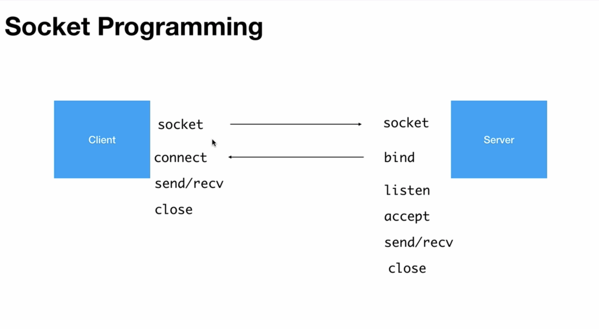
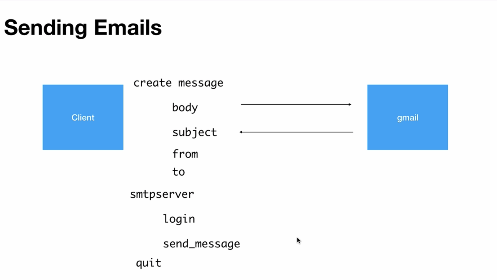
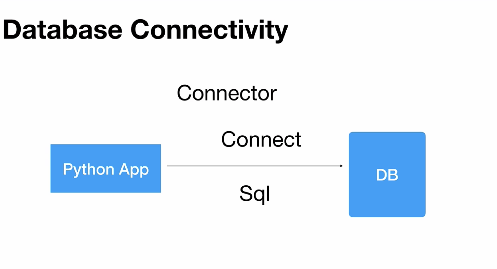
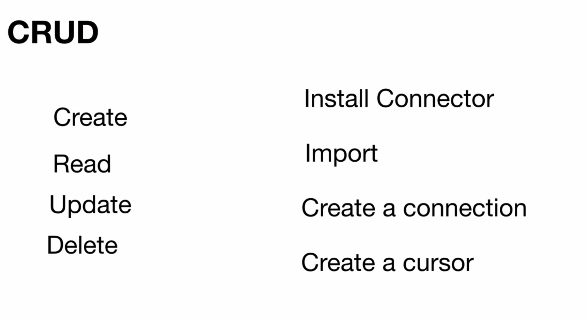
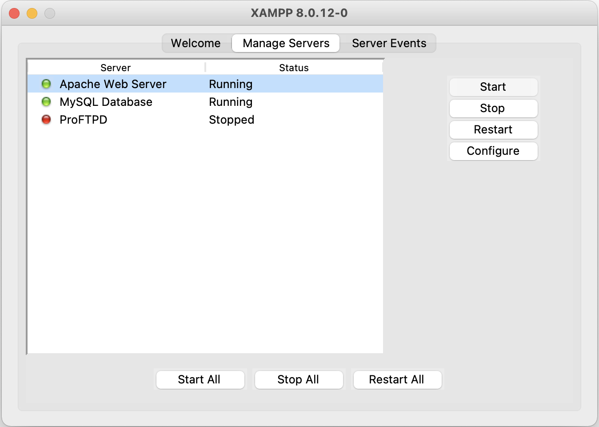
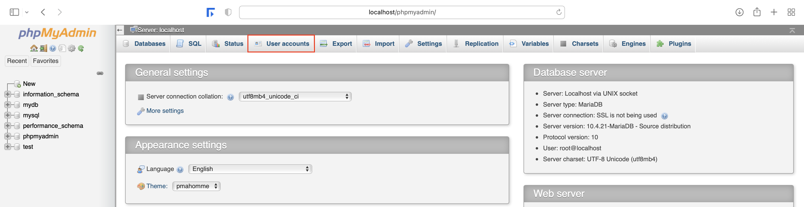
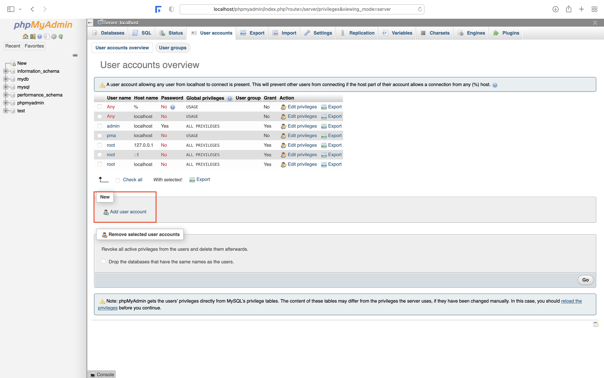
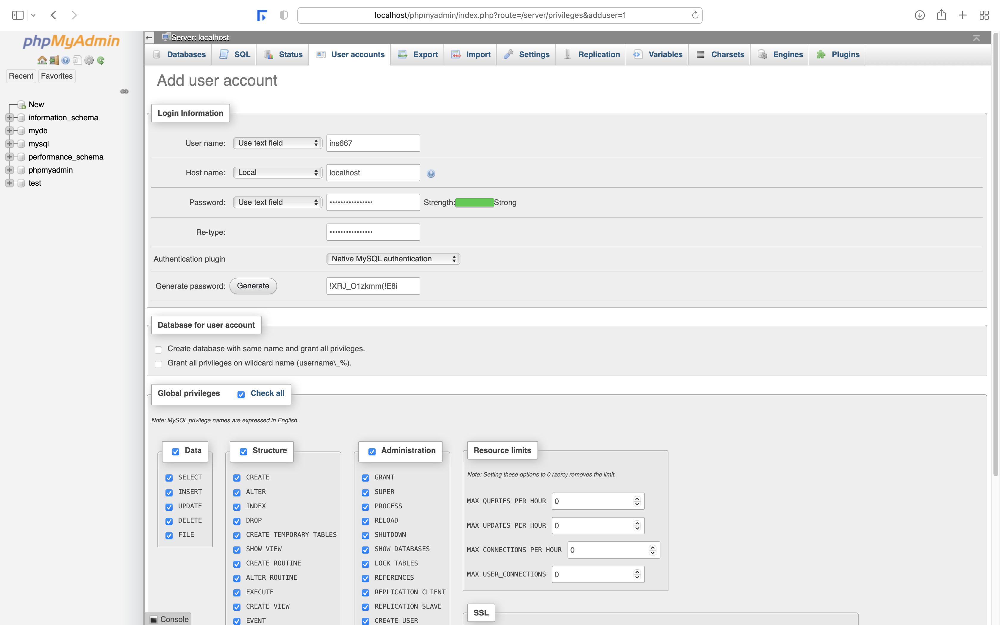
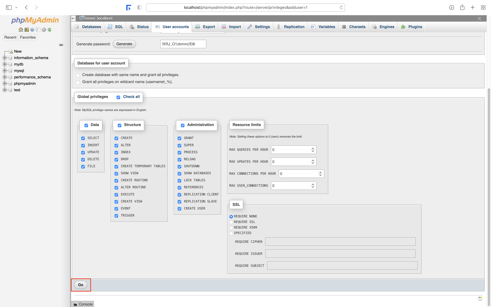

# Python3 Notebook

## Python Definition and Features

- Python is a interpreted, functional and object-oriented programming language.
- Interpreted = It involves no compilation steps, hence performance of a python application is really fast.
- Python supports both functional and object-oriented principals.
- Python is easy to learn because of its simple syntax.
- We can also develop applications quickly because of its inbuilt modules or libraries and Python can easily integrate any third party library.
- Python is dynamically typed. That is, we need not to specify what data type we are going to assign to a variable, Python is going to decide the type of a variable on runtime.
- Python has a huge community support.
- Instead of curly braces, Python uses indentation to recognize a block of code and as a standard or common-practice 4 spaces on the left is used by most programmers.

## First Python Program to Print 'Hello World'

```python
print('Hello World')
```

## Comments

- Single line comment:  

    ```python
    # This is a single line comment
    ```

- Multi-line comments / doc-strings (Document the author name, date, purpose of the code for other programmers):

    ```python
    '''
    This is one way
    of writing a
    multi-line comment
    '''

    """
    This is another way
    of writing a
    multi-line comment
    """
    ```

## Data Types

### Introduction

- A data types tells what type of data a variable can carry.
- In Python the data types are organized mainly into 7 types:
  - None: An object that does not contain any value
  - Numeric Types:
    - int
    - float
    - complex
  - Text Type:
    - str
  - Sequence Types:
    - list
    - tuple
    - range
  - Set Types:
    - set
    - frozenset
  - Mapping Type:
    - dict
  - Boolean Type:
    - bool
  - Binary Types:
    - bytes
    - bytearray
    - memoryview

### Numeric Types

```python
# int type
a = 13
b = -14
print(a, b)             # 13, -14
print(type(a))          # <class 'int'>

# float type
p = 10.5
q = -29.0
print(p, q)             # 10.5 -29.0
print(type(p))          # <class 'float'>

# complex type
d = 3 + 5j
print(d)                # (3 + 5j)
print(type(d))          # <class 'complex'>
print(d.real)           # 3.0
print(d.imag)           # 5.0

# binary type
e = 0b1010              # 'b' can be in small or capital letter
print(e)                # 10

# hexadecimal type
f = 0xFF                # 'x' can be in small or capital letter
print(f)                # 255

# octal type
g = 0o17                # 'o' can be in small or capital letter
print(g)                # 15
```

### Boolean Type

```python
# bool type
a = True
b = (9 > 8)

print(b)                # True
print(type(b))          # <class 'bool'>
```

### Special Behaviors

```python
import keyword
print(keyword.kwlist)   # ['False', 'None', 'True', '__peg_parser__', 'and', 'as', 'assert', 'async', 'await', 'break', 'class', 'continue', 'def', 'del', 'elif', 'else', 'except', 'finally', 'for', 'from', 'global', 'if', 'import', 'in', 'is', 'lambda', 'nonlocal', 'not', 'or', 'pass', 'raise', 'return', 'try', 'while', 'with', 'yield']

print(True or False)    # True
print(True and False)   # False
print(True == 1)        # True
print(False == 0)       # True
print(True + True)      # 2
print(False + True)     # 1
print(None == 0)        # False
print(None == [])       # False
print(None == False)    # False

x = None
y = None
print(x == y)           # True

def getRes(x, y):
    z = x + y

result = getRes(5, 7)
print(result)           # None
```

### Type Conversion

```python
# float to int
a = 33.5
b = int(a)
print(b)                # 33
print(type(b))          # <class 'int'>

# string to float
c = float('22.7')
print(c)                # 22.7
print(type(c))          # <class 'str'>

# decimal to binary
print(bin(10))          # 0b1010

# decimal to hexadecimal
print(hex(10))          # 0xa

# decimal to octal
print(oct(10))          # 0o12
```

### Rules to Form an Identifier

- The names we give to the variables or functions are called identifiers.
- Python identifiers are case-sensitive.
- An identifier name can have numbers in middle or at the end, but it cannot start with a number.
- We can have any number of underscores (_) anywhere with-in an identifier name.
- We can't have special symbols like dollar ($) or pound (#) characters anywhere with-in the identifier name.
- We can't use keywords as an identifier name.

__Special Note__:

- `_var1` / `_func1()` : Private variable or private method
- `__var2` / `__func1()` : Really private variable or private method.
- `__init__` : Special function or a magic function.

### List, Set and Dictionary

- List: A list can store any number of values or objects dynamically and it maintains the order of them.
- Set: A set can store any number of values dynamically, but it does not allow duplicates.
- Dictionary: It is a map, can be used to store key and value pairs.

### Text Type

```python
str1 = 'You are awesome'
print(str1)

str2 = '''You are
the creator
of your destiny'''
print(str2)

# indexing: reaching out to a particular character or location in a string
# index always starts with 0 and goes till (length of the string - 1)
print(str1[2])          # u

# repetition: performing operation on the string several times
print(str1 * 2)         # You are awesomeYou are awesome

# retrieving the number of characters in a string
print(len(str2))        # 35
```

### String Manipulation

```python
str1 = 'You are awesome'

# SLICING
# syntax: str_var[beg_index:end_index:step] 
# get characters from 0 to 5
# it does not include the character at the ending index
print(str1[0:5])                        # You a

# get characters from 2nd position to the end
print(str1[2:])                         # u are awesome

# get characters from the beginning till the 8th position
print(str1[:8])                         # You are 

# get characters from the 3rd position from the end to the end
# -1 represents the last character of the string
print(str1[-3:-1])

# getting characters given a step
# by default the step value is 1
print(str1[0:9:2])                      # Yuaea

# get characters from the end to the beginning
print(str1[len(str1)::-1])              # emosewa era uoY
print(str1[::-1])                       # emosewa era uoY


# STRIPPING
# removing white-spaces from the beginning and the end of the string
str2 = '  Have a nice day     '
print(str2)                             #    Have a nice day     
print(str2.strip())                     # Have a nice day

# removing white-spaces from the beginning of the string
print(str2.lstrip())                    # Have a nice day     

# removing white-spaces from the end of the string
print(str2.rstrip())                    #    Have a nice day


# SEARCHING (CHARACTER / SUBSTRING)
# syntax: str_var.find(str_to_search:beg_index:end_index)
# find the location of a substring in a given string
# If find() is unable to get the substring then it returns -1
print(str1.find('awe'))                 # 10
print(str1.find('awe', 0, len(str1)))   # 10
print(str1.find('awe', 0, 8))           # -1

# get the index of the substring if it is present in the string
# throws ValueError if the substring is not present in the string
# syntax: str.index(sub_string, <start_index>, <end_index>)
print(str1.index('are'))                # 4
print(str1.index('are', 4, 10))         # 4

# check if a substring is present at the end in the given string
print(str1.endswith('some'))            # True

# check if a substring is present at the beginning in the given string
print(str1.startswith('You'))           # True


# COUNT OCCURRENCES (CHARACTER / SUBSTRING)
# syntax: str_var.count(str_to_search:beg_index:end_index)
# If count() is unable to get any occurrences of given substring then it returns 0
print(str1.count('a'))                  # 2
print(str1.count('a', 10, len(str1)))   # 0


# REPLACEMENT (CHARACTER / SUBSTRING)
# syntax: str_var.replace('old_str', 'new_str')
print(str1.replace('awesome', 'super')) # You are super


# SWITCHING CASES
str3 = 'Winner Winner! Chicken dinner'
print(str3.upper())                     # WINNER WINNER! CHICKEN DINNER
print(str3.lower())                     # winner winner! chicken dinner
print(str3.casefold()                   # winner winner! chicken dinner
print(str3.title())                     # You Are Awesome
print(str3.capitalize())                # Winner winner! chicken dinner
print(str3.swapcase())                  # wINNER wINNER! cHICKEN DINNER


# DESIGN / ALIGNMENT
# adding width on both sides to center the text
print(str3.center(50))                  #           Winner Winner! Chicken dinner           


# STRING VALIDATIONS
print('abc123'.isalnum())               # True
print('abc 123'.isalnum())              # False
print('abcdef'.isalpha())               # True
print('ab12#$%-.lP'.isascii())          # True
print('203'.isdecimal())                # True
print('abcd'.isdecimal())               # False
print('904238'.isdigit())               # True
print('9042.38'.isdigit())              # False
print('abc1'.isidentifier())            # True
print'abc$'.isidentifier())             # False
print('1abc'.isidentifier())            # False
print('1ab,c'.islower())                # True
print('Cab2'.islower())                 # False
print('0123'.isnumeric())               # True
print('123.10'.isnumeric())             # False
print('Ab#91.33'.isprintable())         # True
print('     '.isspace())                # True
print('	a   '.isspace())                # False
print('You Are'.istitle())              # True
print('You are'.istitle())              # False
print('ABCDE'.isupper())                # True


# SPLITTERS
print('ABCDE'.partition('C'))           # ('AB', 'C', 'DE')
print('ABCDE'.partition('E'))           # ('ABCD', 'E', '')
print('ABCDE'.partition('A'))           # ('', 'A', 'BCDE')
print('ABCDE'.partition('F'))           # ('ABCDE', '', '')

print('ABCDE'.removeprefix('AB'))       # CDE
print('ABCDE'.removeprefix('AC'))       # ABCDE
print('ABCDE'.removesuffix('DE'))       # DE
print('ABCDE'.removesuffix('KE'))       # ABCDE

print('ABCDE'.split('C'))               # ['AB', 'DE']
print('ABCDE'.split('F'))               # ['ABCDE']
print('ABC\nDE'.splitlines())           # ['ABC', 'DE']
```

### Sequence Type - list

- A list type in Python is mutable in nature.

```python
lst = [10, 20, 'Deepjyoti', -50, 80, 48.9]
print(lst)

# We can perform indexing, slicing and repetition on a list
# INDEXING
print(lst[3])                           # -50 

# SLICING
print(lst[3:5])                         # [-50, 80]

# REPETITION
print(lst * 2)                          # [10, 20, 'Deepjyoti', -50, 80, 48.9, 10, 20, 'Deepjyoti', -50, 80, 48.9]

# finding length of a list
print(len(lst))                         # 6

# adding an element to a list at the end
lst.append(77)
print(lst)                              # [10, 20, 'Deepjyoti', -50, 80, 48.9, 77]

# adding an element to a list at a given position
# index beyond the length of the list will add the new element at the end
# negative index will add the new element counting position from the end
lst.insert(0, 5)
print(lst)                              # [5, 10, 20, 'Deepjyoti', -50, 80, 48.9, 77]

# removing an element from the list by value
# if the element to be removed is not found the Python interpreter will throw ValueError
lst.remove('Deepjyoti')
print(lst)                              # [5, 10, 20, -50, 80, 48.9, 77]

# removing an element from the list by index
del(lst[3])                             # [5, 10, 20, 80, 48.9, 77]

# retrieving the maximum element in the list
print(max[lst])                         # 80

# retrieving the minimum element in the list
print(min[lst])                         # 5

# counting the occurrences of an element in a list
print(lst.count(20))                    # 1
print(lst.count(99))                    # 0

# retrieving the index of an element in a list
# if the given element is not found the Python interpreter will throw ValueError
print(lst.index(10))                    # 1

# sorting list in ascending order
lst.sort()
print(lst)                              # [5, 10, 20, 48.9, 77, 80]

# sorting list in descending order
lst.sort(reverse=True)
print(lst)                              # [80, 77, 48.9, 20, 10, 5]

# reverse a list
lst.reverse()                           # [5, 10, 20, 48.9, 77, 80]

# add multiple elements in a list at the end
lst.extend([90, 99])                    # [5, 10, 20, 48.9, 77, 80, 90, 99]

# creating a deep copy of a list
lst2 = lst
print(lst)                              # [5, 10, 20, 48.9, 77, 80, 90, 99]
print(lst2)                             # [5, 10, 20, 48.9, 77, 80, 90, 99]

lst.remove(5)
print(lst)                              # [10, 20, 48.9, 77, 80, 90, 99]
print(lst2)                             # [10, 20, 48.9, 77, 80, 90, 99]

# creating a shallow copy of a list
lst3 = lst.copy()
print(lst)                              # [10, 20, 48.9, 77, 80, 90, 99]
print(lst3)                             # [10, 20, 48.9, 77, 80, 90, 99]

lst.remove(48.9)
print(lst)                              # [10, 20, 77, 80, 90, 99]
print(lst3)                             # [10, 20, 48.9, 77, 80, 90, 99]

# remove all the elements present in a list
lst.clear()
print(lst)                              # []
```

### Sequence Type - tuple

- tuple is just like a list data-structure, but it is immutable / read-only (i.e. once we create a tuple we can't modify it).
- A tuple maintains the insertion order.
- A tuple allows duplicate elements.
- We can add heterogeneous / different types of elements in a tuple.
- We can create a tuple by using parenthesis (). The parenthesis are optional, but it is recommended to use it as it makes the code much more readable.
- If we have a single value in a tuple then we should always end it with a comma or else Python interpreter will treat it as a single element variable. (e.g. tup = 1, )

```python
tpl = (20)
print(tpl)                              # 20
print(type(tpl))                        # <class 'int'>

tpl = (20, )
print(tpl)                              # (20,)
print(type(tpl))                        # <class 'tuple'>

tpl = (20, 30, 20, 'xyz')
# tpl[2] = 123                          # TypeError: 'tuple' object does not support item assignment
print(tpl)                              # (20, 30, 20, 'xyz')
print(tpl * 2)                          # (20, 30, 20, 'xyz', 20, 30, 20, 'xyz')

# counting the occurrences of an element in a tuple
print(tpl.count(20))                    # 2

# retrieving the index of an element in a tuple
# if the given element is not found the Python interpreter will throw ValueError
print(tpl.index('xyz'))                 # 3

# get the last 3 elements of the tuple
print(tpl[-3:])                         # (30, 20, 'xyz')

# note: we can use all the methods of a list in a tuple which do not manipulate its elements

# conversion: tuple to list
lst = list(tpl)
print(lst)                              # [20, 30, 20, 'xyz']
print(type(lst))                        # <class 'list'>

# conversion: list to tuple
tpl = tuple(lst)
print(tpl)                              # 20, 30, 20, 'xyz')
print(type(tpl))                        # <class 'tuple'>
```

### list vs tuple

- list uses square brackets to wrap a list of elements, whereas tuple uses parenthesis.
- For a list using square brackets are mandatory, whereas for a tuple its optional to use a pair of parenthesis.
- list is mutable, whereas tuple is immutable.
- list should be used in situations where we need to do manipulations on the elements, tuple should be used where consistency of the elements are mandatory.
- A list cannot be used as a key to the dictionary, because a dictionary key should be hashable and immutable, since tuple is immutable we can use tuple as a key to the dictionary.

### Set Types - set and frozenset

- A set type in Python is mutable in nature.
- The set sequence type does not allow duplicates.
- set does not maintain any order of its elements.
- We cannot perform indexing, slicing or repetition on a set.
- A frozenset does not allow add, update or remove operation in a set.
- A frozenset type in Python is immutable in nature.
- A set supports multiple other methods like union(), intersection(), difference(), isdisjoint(), issubset(), issuperset() etc.

```python
st = {10, 20, 30, 'xyz', 10, 20, 10}
print(st)                               # {'xyz', 10, 20, 30}
print(type(st))                         # <class 'set'>

# adding a new element into the set
st.add(5)
print(st)                               # {5, 10, 'xyz', 20, 30}

# adding multiple new elements to a set
st.update([88, 99])                     
print(st)                               # {99, 5, 10, 'xyz', 20, 88, 30}

# print(st[2])                          # TypeError: 'set' object does not support indexing
# print(st[0:5])                        # TypeError: 'set' object is not subscriptable
# print(st * 3)                         # TypeError: unsupported operand type(s) *: 'set' and 'int'

# removing element from a set
st.remove(99)                           
print(st)                               # {5, 10, 'xyz', 20, 88, 30}
# st.remove(45)                         # KeyError

# removing an element from a set if it is a member
st.discard(45)
print(st)                               # {5, 10, 'xyz', 20, 88, 30}
st.discard(88)
print(st)                               # {5, 10, 'xyz', 20, 30}

# removing an arbitrary element from the set
element = st.pop()
print(element)                          # 5
print(st)                               # {10, 'xyz', 20, 30}

# creating a shallow copy of a set
st2 = st.copy()
st.remove(30)
print(st)                               # {10, 'xyz', 20}
print(st2)                              # {'xyz', 10, 20, 30}

# INTERSECTION
st3 = st.intersection(st2)
print(st3)                              # {'xyz', 10, 20}

# DIFFERENCE
st3 = st2.difference(st)
print(st3)                              # {30}

# verify if another set contains this set
is_subset = st.issubset(st2)
print(is_subset)                        # True

# verify if this set contains another set
is_superset = st2.issuperset(st)
print(is_superset)                      # True

# removing all the elements from a set
st.clear()
print(st)                               # set()

fs = frozenset(st)
# fs.update([20])                       # AttributeError: 'frozenset' object has no attribute 'update'
# fs.remove(20)                         # AttributeError: 'frozenset' object has no attribute 'remove'       
```

### Sequence Type - range

- A range type in Python is immutable in nature.
- Syntax: `range(<start_value>, end_value, <step>)`

```python
# range with only one argument
r = range(5)
print(r)                                # range(0, 5)

for i in r:
    print(i, end=' ')                   # 0 1 2 3 4 

# range with two arguments
r = range(1, 6)

for i in r:
    print(i, end=' ')                   # 1 2 3 4 5 

# range with three arguments
r = range(1, 15, 3)

for i in r:
    print(i, end=' ')                   # 1 4 7 10 13 
```

### Binary Types - bytes and bytearray

- The maximum we can provide to a byte is 255.
- We cannot perform addition, modification or deletion operation in a bytes data type.
- We can perform addition, modification or deletion operation in a bytearray data type.
- No slicing or repetition is allowed on bytes or bytearray data types.
- Some important methods for bytes data type: count(), endswith(), find(), index(), join(), lower(), partition(), replace(), split(), startswith(), strip(), title(), upper()
- Some important methods for bytearray data type: append(), clear(), copy(), count(), endswith(), find(), index(), insert(), join(), lower(), partition(), pop(), remove(), replace(), reverse(), split(), strip(), title(), upper().

```python
lst = [20, 30, 40, 234]
print(type(lst))                        # <class 'list'>

b = bytes(lst)
print(b)                                # b'\x14\x1e(\xea'
print(type(b))                          # <class 'bytes'>

# b[3] = 22                             # TypeError: 'bytes' object does not support item assignment

b1 = bytearray(lst)
print(b1)                               # bytearray(b'\x14\x1e(\xea')
print(type(b1))                         # <class 'bytearray'> 

b1[3] = 22                              # No error
```

### Mapping Type - dict

- A dict type in Python is mutable in nature.
- The dict data type stores data in the form of key-value pair.
- The key and value both can be of any type.
- If same key is present two or more times then only the last value assigned to that key will be considered.

```python
dict1 = {
    1 : "john",
    2 : "bob",
    3 : "bill"
}
print(dict1)                            # {1: 'john', 2: 'bob', 3: 'bill'}
print(type(dict1))                      # <class 'dict'>

# accessing all the key-value pairs of the dictionary
kv_pairs = dict1.items()
print(kv_pairs)                         # dict_items([(1, 'john'), (2, 'bob'), (3, 'bill')])

# accessing all the keys of the dictionary
# keys() method only returns unique set of keys without any duplicates
k = dict1.keys()
print(k)                                # dict_keys([1, 2, 3])

for i in k:
    print(i, end=' ')                   # 1 2 3 

# accessing all the values of the dictionary
v = dict1.values()
print(v)                                # dict_values(['john', 'bob', 'bill'])

for i in v:
    print(i, end=' ')                   # john bob bill 

# accessing one value at time by key
print(dict1[2])                         # bob

# get the value for the key if the key is present in the dictionary else get None
value = dict1.get(4)
print(value)                            # None

value = dict1.get(3)
print(value)                            # bill

# create a new dictionary taking keys from the given iterable (list, tuple, set, range, map etc)
dict2 = dict1.fromkeys(range(5), 'dj')
print(dict2)                            # {0: 'dj', 1: 'dj', 2: 'dj', 3: 'dj', 4: 'dj'}

# same can be done using dict class
dict3 = dict.fromkeys(dict1)
print(dict3)                            # {1: None, 2: None, 3: None}

# insert key with a value (set to None when not given) if the key is not present and return the new value
# if the key is present return the value of the respective key
v1 = dict1.setdefault(4)
print(v1)                               # None
print(dict1)                            # {1: 'john', 2: 'bob', 3: 'bill', 4: None}

v2 = dict1.setdefault(5, 'mickey')
print(v2)                               # mickey
print(dict1)                            # {1: 'john', 2: 'bob', 3: 'bill', 4: None, 5: 'mickey'}

v3 = dict1.setdefault(3)
print(v3)                               # bill
print(dict1)                            # {1: 'john', 2: 'bob', 3: 'bill', 4: None, 5: 'mickey'}

dict1 = {
    1 : "john",
    2 : "bob",
    3 : "bill"
}

# update the dictionary with the elements from another dictionary object or from an iterable of key/value pairs
# if the given key is present update the value for the key in the dictionary
# if the given key is not present insert the key-value pair in the dictionary
dict1.update({1 : 'richard' })
print(dict1)                            # {1: 'richard', 2: 'bob', 3: 'bill'}

dict1.update({4 : 'peter'})
print(dict1)                            # {1: 'richard', 2: 'bob', 3: 'bill', 4: 'peter'}

# given a key remove the key-value pair from the dictionary and return the value
# throws KeyError if the key does not exist
val = dict1.pop(2)
print(val)                              # bob
print(dict1)                            # {1: 'richard', 3: 'bill', 4: 'peter'}

# remove and return a key-value pair as a tuple
# usually removes the last key-value pair
# throws KeyError when the dictionary is empty are we are calling this method to pop out a key-value pair
val = dict1.popitem()
print(val)                              # (4, 'peter')
print(type(val))                        # <class 'tuple'>
print(dict1)                            # {1: 'richard', 3: 'bill'}

dict1 = {
    1 : "john",
    2 : "bob",
    3 : "bill"
}

# removing a key-value pair from the dictionary
# throws KeyError if the key is not present in the dictionary
del(dict1[2])
print(dict1)                            # {1: 'john', 3: 'bill'}

del dict1[3]
print(dict1)                            # {1: 'john'}

# removing all the key-value pairs from the dictionary
dict1.clear()
print(dict1)                            # {}
```

### Immutability in Python

- When we define a variable in Python `a = 10` the PVM or Python Virtual Machine will store and allocate the memory for this value and the variable `a` will point to it. When we again declare a variable `b = 10`, PVM will first check if the value `10` is stored somewhere else in any memory location. If the memory location is found then PVM will not allocate new memory for the value `10` instead variable `b` will point to the same memory location pointed by variable `a`, saving us space. If we reassign a new value `b = 14` in this case PVM will store and allocate memory in a new location for this value and variable `b` will not point to it. This process is called immutability, where we cannot change the value in an existing memory location, instead a new memory location will be created whenever needed and the variable will point to that.
- Unlike Java, all primitive types and some object types in Python are immutable, whereas in Java only String object type is immutable.

```python
a = 10
b = 10

# retrieving the memory location of a
print(id(a))                            # 4353423952

# retrieving the memory location of b
print(id(b))                            # 4353423952

# comparing a and b by reference
print(a is b)                           # True

b = 20
print(id(b))                            # 4353424272
print(a is b)                           # False
```

### Special Types

- `None`: When we don't have any value to assign yet in a variable in our program, but still we want to assign some value to it - we can assign `None` to it.
- If a method in Python is not returning any value by default it will return None.
- An escape character is a character that invokes an alternative interpretation on the following characters in a character sequence.
- An escape character is a backslash \ followed by the character you want to insert.
- Some most used escape characters are \n, \t, \\" etc.
- In Java we have `final` keyword to declare a constant, in C or C++ we have a keyword `const` to declare a constant, but in Python we follow a convention where we will use all capital letters while naming a constant.
- `del` keyword can be used for cleanup or delete objects within our program.

```python
# None use-cases
a = None
print(a)                                # None

def m1():
    b = 10

print(m1())                             # None

# escape characters
print("He is known as \"God of All Time\"")         # He is known as "God of All Time"
print("Mike\t&\tTike are best friends")             # Mike	&	Tike are best friends

# constants
# this convention conveys the message to other developer that during their development they should to alter values for these variables
PI = 3.14
MAX_VALUE = 999
INTEREST_RATE = 7.3

# del keyword
c = 29
del c
# print(c)                              # NameError: name 'c' is not defined

# We can delete a string object, but we can't delete a character from it as str type is immutable in nature
s = 'abcd'
# del s[0]                              # TypeError: 'str' object doesn't support item deletion
```

## Operators and Operands

### Arithmetic Operators

- Arithmetic operators are:
  - Addition: +
  - Subtraction: -
  - Multiplication: *
  - Division: /
  - Remainder of a division / Modulo division: %
  - Exponent / Power: **
  - Integer division / Floor division: //

```python
a, b = 10, 4

print('a + b =', a + b)                 # a + b = 14
print('a - b =', a - b)                 # a - b = 6
print('a * b =', a * b)                 # a * b = 40
print('a / b =', a / b)                 # a / b = 2.5
print('a % b =', a % b)                 # a % b = 2
print('a ** b =', a ** b)               # a ** b = 10000
print('a // b =', a // b)               # a // b = 2
```

### Assignment Operators

- Assignment operators are:
  - Single equal / simple assignment: =
  - Compound assignment (with arithmetic operators): +=, -=, *=, /=, %=, **=, //=
  - Compound assignment (with bitwise operators): &=, |=, ^=, >>=, <<=

```python
# chain assignment
a = b = c = 10
print(a, b, c)                          # 10 10 10

# compound assignment
x, y = 10, 5
x += y
print(x)                                # 15
```

### Comparison Operators

- Comparison operators are:
  - Double equals / Equality / Equal to: ==
  - Not equal to: !=
  - Greater than: >
  - Less than: <
  - Greater than or equal to: >=
  - Less than or equal to: <=

```python
x, y = 77, 88

print(x == y)                           # False
print(x != y)                           # True
print(x > y)                            # False
print(x < y)                            # True
print(x >= y)                           # False
print(x <= y)                           # True
```

### Logical Operators

- Logical operators always work with boolean values (operands are of bool type).
- Logical operators are:
  - AND: and
  - OR: or
  - NOT: not

```python
x, y = 20, 30

print(x == 20 and y == 30)              # True
print(x == 25 and y == 30)              # False

print(x == 25 or y == 30)               # True
print(x == 25 or y == 31)               # False

print(not(x == 25 or y == 31))          # True
```

### Bitwise Operators

- Bitwise operators are:
  - Bitwise AND: &
  - Bitwise OR: |
  - Bitwise NOT: ~
  - Bitwise XOR: ^
  - Bitwise right shift: >>
  - Bitwise left shift: <<

```python
# x = 10 = (0000 1010) in binary
x = 10

# y = 4  = (0000 0100) in binary
y = 4

# (0000 0000)
print(x & y)                            # 0

# (0000 1110)
print(x | y)                            # 14

# (0000 1110)
print(x ^ y)                            # 14

# (1111 0101) = 2's complement => -11
print(~x)                               # -11

# (0000 0010)
print(x >> 2)                           # 2

# (0010 1000)
print(x << 2)                           # 40
```

### Membership Operators

- Membership operators are used to check an item or an element that is part of a string, a list, a tuple or any sequence.
- Membership operators are:
  - in - Returns true, if item is present in the list or sequence.
  - not in - Returns true, if item is not present in the list or sequence.

```python
print(10 in [20, 10, 30, 60])           # True
print('s' in 'switzerland')             # True
print(4 not in range(1, 20))            # False
```

### Identity Operators

- Identity operators are used to check whether reference of both operands are same or not.
- Identity operators are:
  - is - Returns true, if reference of both the operands are same.
  - is not - Returns true, if reference of both the operands are different.

```python
a = 10
b = 10
c = 20

print(a is b)                           # True
print(b is c)                           # False
print(a is not c)                       # True
```


### Precedence of Operators

- Following is the operator precedence table in lower to higher order:

| Operator                        | Description                                                |
| :------------------------------ | :--------------------------------------------------------- |
| NOT, OR, AND                    | Logical operators                                          |
| in, not in                      | Membership operators                                       |
| is, not is                      | Identity operators                                         |
| =, %=, /=, //=, +=, -=, *=, **= | Assignment operators                                       |
| <>, ==, !=                      | Equality operators                                         |
| >, <, >=, <=                    | Comparison operators                                       |
| ^, \|                           | Bitwise XOR, Bitwise OR operator                           |
| &                               | Bitwise AND operator                                       |
| <<, >>                          | Bitwise left shift, Bitwise right shift operator           |
| +, -                            | Addition, Subtraction operator                             |
| *, /, %, //                     | Multiplication, Division, Modulus, Floor division operator |
| **                              | Exponential operator                                       |

## Input and Output Functions

```python
# different use of print() function
print()                                 # adds an empty newline
print('Hello')                          # Hello
print('Hello ' * 3)                     # Hello Hello Hello
print('India \nis the best')            # India
                                        # is the best

item, price = 'apple', 70
print(item, price)                      # apple 70
print(item, price, sep=' | ')           # apple | 70
print('Hello', end=' ')
print('World')                          # Hello World

# STRING FORMATTING
# using addition operator
print('An ' + item + ' costs ' + str(price) + ' rupees per kilo')           # An apple costs 70 rupees per kilo

# using comma operator
print('An', item, 'costs', price, 'rupees per kilo')                        # An apple costs 70 rupees per kilo

# using modulo operator
print('An %s costs %i rupees per kilo' % (item, price))                     # An apple costs 70 rupees per kilo

# using format method
print('An {} costs {} rupees per kilo'.format(item, price))                 # An apple costs 70 rupees per kilo
print('An {1} costs {0} rupees per kilo'.format(price, item))               # An apple costs 70 rupees per kilo
print('An {arg0} costs {arg1} rupees per kilo'.format(arg0=item, arg1=price))   # An apple costs 70 rupees per kilo

# using join method
print("".join(['An ', item, ' costs ', str(price), ' rupees per kilo']))    # An apple costs 70 rupees per kilo

# using f-string (The best and most recommended way)
print(f'An {item} costs {price} rupees per kilo')
```

```python
# reading input from user without a message
name = input()                                  # Deepjyoti
print(name)                                     # Deepjyoti

# reading input from user with a message
occ = input('What is your occupation? ')        # What is your occupation? Student
print(occ)                                      # Student

# reading integer input from user
age = int(input('How old are you? '))           # How old are you? 28
print(age)                                      # 28
print(type(age))                                # <class 'int'>

# reading multiple inputs from the user using input()
num_list1 = [x for x in input('Enter any three number separated by space: ').split()]    # Enter any three number separated by space: 1 2 3
print(num_list1)                                # ['1', '2', '3']


num_list2 = [float(x) for x in input('Enter any three number separated by comma: ').split()]    # Enter any three number separated by space: 1.4,2.7,3.9
print(num_list1)                                # [1.4, 2.7, 3.9]
```

```python
# program: find the area of a circle reading the radius from the end-user
import math

radius = float(input('Enter the radius of the circle: '))          # Enter the radius of the circle: 5
# area = math.pi * radius ** 2
area = math.pi * math.pow(radius, 2)
print('Area of the circle: %.2f' % area)        # Area of the circle: 78.54
```

## Flow Control Statements

- Flow control determines the order in which the statements are executed at runtime.
- They are categorized into:
  - Conditional statements
  - Iterative / looping statements
  - Transfer statements
- Conditional Statements: Allows us to execute our code conditionally (i.e based on a given condition). These are:
  - if
  - if..else
  - if..elif..else (if-else ladder)
- Looping Statements: Allows us to execute same set of statements or logics multiple times. These are:
  - while
  - for
- Transfer Statements: Allows us to transfer the control of our program from one place to another. These are:
  - break
  - continue
  - pass
  - return

### if / if..else / if..elif..else

```python
num = int(input('Enter any number: '))          # Enter any number: 4

# if
# checking if the number is even
if num % 2 == 0:
    print(f'{num} is even')                     # 4 is even

# if..else
# checking if the number is even or odd
if (num % 2 == 0):
    print(f'{num} is even')                     # 4 is even
else:
    print(f'{num} is odd')

# if..elif..else
# checking if the number is even, odd or a zero
if num == 0:
    print(f'{num} is neither odd nor even')
elif num % 2 == 0:
    print(f'{num} is even')                     # 4 is even
else:
    print(f'{num} is odd')
```

### while loop

```python
num = 1

# while
# printing values from 1 to 20
while (num <= 20):
    print(num, end=' ')                         # 1 2 3 4 5 6 7 8 9 10 11 12 13 14 15 16 17 18 19 20 
    num += 1
```

```python
# program: print all odd numbers in a given range
start = int(input('Enter the starting number of the range: '))      # Enter the starting number of the range: 2
end   = int(input('Enter the ending number of the range: '))        # Enter the ending number of the range: 9

if start % 2 == 0:
    start += 1

while start <= end:
    print(start, end=' ')                       # 3 5 7 9 
    start += 2
```

### for loop

- A for loop in Python is a sequence based loop (i.e. it works only with sequences).
- A for loop is typically used to iterate over the elements of a sequence like string, list, tuple, set, range etc.

```python
# for
# printing values from 50 to 70
for i in range(50, 71):
    print(i, end=' ')                           # 50 51 52 53 54 55 56 57 58 59 60 61 62 63 64 65 66 67 68 69 70 
```

### break

```python
# break
# break out of the loop if number 5 is present in the loop, else print all the elements
lst = [1, 4, 9, 7, 5, 2, 8]

for i in lst:
    if i == 5:
        break
    print(i, end=' ')                           # 1 4 9 7
```

### continue

```python
# continue
# print 1 to 20 while skipping multiples of 3
for i in range(1, 21):
    if i % 3 == 0:
        continue
    print(i, end=' ')                           # 1 2 4 5 7 8 10 11 13 14 16 17 19 20 
```

### assert

- assert will abnormally terminate the flow of a program raising an AssertionError if the condition given next to this statement found to evaluate `False`.

```python
# validate if the number given by the end-user is greater than 10
num = int(input('Enter any number greater than 10: '))      # Enter any number greater than 10: 2

assert num > 10, 'Wrong number entered'         # AssertionError: Wrong number entered
print('PASS - you have entered', num)
```

### pass

- In Python, pass is a null statement. The interpreter does not ignore a pass statement, but nothing happens and the statement results into no operation.
- The pass statement is useful when you don’t write the implementation of a function but you want to implement it in the future.
- pass primarily used to avoid compilation errors, when some code block is left empty. It has become a need for the programmers because unlike other languages Python do not use curly braces {} to identify an empty block without any statements.

```python
# pass (example - 1)
def addition(num1, num2):
    pass

addition(2, 2)

# pass (example - 2)
# prints the number if it is not 2
number = 3
if number == 2:
    pass
else:
    print ('Number: ', number)                  # Number: 3
```

### return

- The return statement is used to return values from functions / methods.

```python
def getName():
    name = input('What is your name? ')         # What is your name? Deepjyoti
    return name

nm = getName()
print('Nice to meet you %s' % nm)               # Nice to meet you Deepjyoti
```

### eval

- eval is a built-in function used in Python.
- eval function parses the expression argument and evaluates it as a Python expression. In simple words, the eval function evaluates the "String" like a python expression and returns the result as an integer.
- Syntax: `eval(expression, [globals[, locals]])`
- Arguments and parameters: The arguments or parameters of eval function are strings, also optionally global and locals can be used as an argument inside eval function, but the globals must be represented as a dictionary and the locals as a mapped object.
- Return value: The return value would be the result of the evaluated expression. Often the return type would be an integer.

```python
num = eval(input('Enter any number of your choice: '))      # Enter any number of your choice: 10 + 10
print(num)                                                  # 20
print(type(eval))                                           # <class 'int'>
```

### Practice Programs

```python
# program: remove duplicate elements from a list
l1 = eval(input('Enter a list of elements: '))              # Enter a list of elements: [10, 20, 30, 40, 30, 20]
l2 = []

for each_value in l1:
    if each_value not in l2:
        l2.append(each_value)

print('List of unique elements:', l2)                       # List of unique elements: [10, 20, 30, 40]
```

```python
# program: count the number of vowels in a given word
word = input('Enter a word: ')                              # Enter a word: eagle
vowels = {'a', 'e', 'i', 'o', 'u'}
results_dict = {}

for char in word:
    if char in vowels:
        # Syntax: dict.get(key, default=None)
        results_dict[char] = results_dict.get(char, 0) + 1

for key, values in sorted(results_dict.items()):
    print(f'{key} is present {values} time(s)')             # a is present 1 time(s)
                                                            # e is present 2 time(s)
```

```python
# program: reverse a string
# approach_1
str1 = input('Enter a string: ')                            # december
print('Revered string:', str1[::-1])                        # Revered string: rebmeced

# approach_2
print('Revered string:', ''.join(reversed(str1)))           # Revered string: rebmeced

# approach_3
lst = list(str1)
lst.reverse()
print('Reversed string:', ''.join(lst))                     # Reversed string: rebmeced
```

```python
# program: print right angled triangle pattern
rows = int(input('Enter the number of rows for the pattern to expand: '))

# approach - 1
for i in range(rows):
    for j in range(i + 1):
        print('*', end=' ')
    print()

# approach - 2 (the python way)
for i in range(rows):
    print('* ' * (i + 1))
```

```python
# program: print pyramid pattern
rows = int(input('Enter the number of rows for the pattern to expand: '))

for i in range(rows):
    print(' ' * rows - i)
    print('* ' * i + 1)
```

```python
# program: find substring in given string
s = 'Take up one idea and make that idea your life. Think and dream of that idea and leave every other idea alone.'
subs = 'idea'
pos = -1
length = len(s)

while True:
    pos = s.find(subs, pos + 1, length)

    if pos == -1:
        break;
    
    print('Found the substring at position: ', pos)
    found = True

if found == False:
    print('Substring is not found')
```

## Command Line Arguments

- The command line arguments are those arguments that are passed when our Python program is run.  
  `> python3 my_program.py 123 abc xyz`
- Main uses of command line argument could be:
  - Passing in a 'File location' dynamically at the runtime (instead of hard-coding it inside our program).
  - Passing in a 'Database name' or 'Connection URL'
  - Passing in a 'Remote IP address'
- The values passed at runtime from command line are saved in a list called 'argv', which is present inside 'sys' module.

```python
# program: calculate the product of all the command line arguments passed
import sys

prod = 1
for i in range(1, len(sys.argv)):
    prod *= int(sys.argv[i])
    i += 1

if len(sys.argv) == 1:
    print('No arguments are passed while running the program')
else:
    print('Result:', prod)
```

## Functions

- A function is a group of statements which perform a certain task.
- Function can be of two type - in-built functions [i.e. input(), print()] and user defined functions.
- User defined functions are used to process data, perform mathematical calculations and so on.
- Variable scopes:
  - 4 scope level: local, global, enclosed and built-in
  - LEGB rule: Local scope > Enclosed scope > Global scope > Built-in scope
  - Blocks like if / for/ while etc statements in Python do not count and the variables used or initialized inside the block of that statement can also be used and accessed outside its scope.
  - Variables are not checked at compile-time, which is why other languages throw an exception. In Python, so long as the variable exists at the time you require it, no exception is thrown.
- Advantages of functions are:
  - Reusability: Once we define a function and the statements inside it those statements need not be repeated at any other place in our application, we can simply invoke or call the function and that particular logic will happen for us.
  - Modularity: When we are working on a huge application we need not put the entire code in one single script of function. We can define multiple functions which will make our application modular.
  - Maintenance: The modularity brings in easy maintenance. If an issue causes in a function or two we can easily find it out and fix then, or if we want to add something new we can just go to a particular function where the change needs to happen and add that functionality easily.
- Special properties or behaviors of functions in Python:
  - A function in Python can return multiple values at a shot. In this case all the values will be returned as a tuple so that they can't be modified and can be simply used.
  - A function in Python can be assigned to a variable, and then used as many no of times as we want.
  - We can have one function inside another function in Python (i.e. nesting of functions is possible). You can use this functionality when you want to break down your logic into multiple pieces and these child / inner functions are only available inside the parent function.
  - A function in Python can take another function as an argument.
  - A function in Python can return another function.
  - A function in Python can accept any variable type - string, int, list, tuple, dict and so on.
- Recursion:
  - Recursion is the process of a function calling itself.
  - While writing a recursive function the very first step is to define a base / end condition, or it will run into an infinite loop.
  - Good place to use recursion is whenever the same logic is repeating in a program.
  - Recursion is not a good candidate for everything, because recursion could be very confusing for people who are reading our program.
- Default arguments:
  - If a function is expecting n arguments and we pass less than n arguments to that function Python interpreter will throw an error, in such cases using default arguments can prove out to be very handy.
  - We can pass in and set default (argument) values for any types.
  - As soon as you pass in a parameter automatically its value will be used, i.e. the default value will not be used.
- Variable / optional arguments:
  - When we don't know the exact number of parameters that a function should accommodate at the time of defining the function, optional arguments can prove out to be very handy.
  - If we name the optional positional argument *args, all extra positional parameters passed into the function will be stored into 'args' as a tuple
  - Name of the optional positional argument can be anything i.e. *args, *pos_params etc, ultimately it's the * which matters.
  - If we name the optional keyword argument **kwargs, all extra keyword parameters passed into the function will be stored into 'kwargs' as a dict.
  - Name of the optional keyword argument can be anything i.e. **kwargs, **key_params etc, ultimately it's the ** which matters.
  - We can pass the optional positional and keyword arguments to other functions and can alter them in between.
- Function annotations
  - Function annotations introduced in Python 3.0 adds a feature that allows you to add arbitrary metadata to function parameters and return value.
  - Since python 3, function annotations have been officially added to python (PEP-3107). The primary purpose was to have a standard way to link metadata to function parameters and return value.
  - Function annotations, both for parameters and return values, are completely optional.
  - Function annotations are nothing more than a way of associating arbitrary Python expressions with various parts of a function at compile-time.
  - The PEP-3107 makes no attempt to introduce any kind of standard semantics, even for the built-in types. All this work left to the third-party libraries.
  - The Python runtime does not enforce function and variable type annotations. They can be used by third party tools such as type checkers, IDEs, linters, etc.
  - Syntax: def func(arg: arg_type, optarg: arg_type = default) -> return_type:
  

```python
# program: create a function to find the average of two numbers
def average(num1, num2):
    print('Average of two numbers:', (num1 + num2) / 2)

average(10, 20)                                 # Average of two numbers: 15.0
```

```python
# program: returning the result from a function
def average(num1, num2):
    return (num1 + num2) / 2

result = average(10, 20)
print('Average of two numbers:', result)        # Average of two numbers: 15.0
```

```python
# program: returning multiple values from a function
def calc(num1, num2):
    a = num1 + num2
    b = num1 - num2
    c = num1 * num2
    d = num1 / num2
    return a, b, c, d

# printing the tuple
result = calc(10, 5)
print(result)                                   # (15, 5, 50, 2.0)

# accessing each value from the tuple
for i in result:
    print(i, end=' ')                           # 15 5 50 2.0
```

```python
# program: demonstrate that the block scope does not exist in Python
x = 2
if x == 2:
    y = 3

if x == 1:
    z = 1

print(y)                                        # 3
# print(z)                                      # NameError: name 'z' is not defined
```

```python
# program: showcase the use and scope of global and local variables in Python
# global variable
x = 123

def display():
    # local variable
    y = 678
    print(x)
    print(y)

print(x)                                        # 123
# print(y)                                      # NameError: name 'y' is not defined
display()                                       # 123
                                                # 678
```

```python
# program: demonstrate that local variable scope takes precedence over global variable scope
# global variable
x = 123

def display():
    # local variable
    x = 678
    print(x)

print(x)                                        # 123
display()                                       # 678
```

```python
# program: accessing global variable with the same name inside the function
x = 123

def display():
    x = 678
    print(x)

    print(globals()['x'])
    globals()['x'] = 999

print(x)                                        # 123
display()                                       # 678
                                                # 123
print(x)                                        # 999
```

```python
# program: enclosed scope, enclosed variable or non-local variable
def outer():
    # x is a local variable to outer() function
    # But, to inner() function x is neither a local variable nor a global variable
    # Hence, x is known as non-local variable / enclosed variable to inner() function
    x = 20
    def inner():
        global x
        x = 88
    print('before calling inner() =', x)        # before calling func2() = 20
    inner()
    print('after calling inner() =', x)         # after calling func2() = 20

outer()
print(x)                                        # 88
```

```python
# program: altering the value of non-local / enclosed variable
def outer():
    x = 20
    def inner():
        nonlocal x
        x = 40
    print('before calling inner() =', x)        # before calling func2() = 20
    inner()
    print('after calling inner() =', x)         # after calling func2() = 40

outer()
```

```python
# program: assigning a Python function to a variable
def func_with_a_very_long_name():
    print('I am function with a very long name')

# assigning function to a variable
short_func = func_with_a_very_long_name

# invoking the function variable
short_func()                                    # I am function with a very long name
short_func()                                    # I am function with a very long name
```

```python
# program: demonstrate nesting function inside another function
def display(name):
    def message():
        return 'Hello '
    
    result = message() + name
    return result

# message()                                     # NameError: name 'message' is not define
print(display('Arnold'))                        # Hello Arnold
```

```python
# program: demonstrate passing of one function as a parameter to another function
def display(func):
    # return 'Hello ' and what ever the other function returns
    return 'Hello ' + func()

def name():
    return 'Bob'

# DON'T USE: print(display(name())) -> this way it invoke name() function and pass the value 'Bob' returned by it (i.e. we will be passing the variable and not the actual function)
print(display(name))                          # Hello Bob
```

```python
# program: demonstrate returning a function from another function
def display():
    def message():
        return 'Hello '
    
    # DON'T USE: return message() -> this way it will be returning the value which is returned after invoking message() function (i.e. we will be returning 'Hello ' and not the actual function)
    return message

# one way
func = display()
print(func() + ' Charlie')                      # Hello Charlie

# second way
print(display()(), 'Charlie')                   # Hello Charlie
```

```python
# program: passing any variable type to a function
def print_list(lst):
    for i in lst:
        print(i, end=' ')

print_list([10, 20, 30, 40])                    # 10 20 30 40
```

```python
# program: find the factorial of a number using recursion
def factorial(n):
    if n == 0:
        result = 1
    else:
        result = n * factorial(n - 1)
    return result

print(factorial(5))                             # 120
```

```python
# program: demonstrate the use of keyword arguments in Python
def display(a, b):
    print(a, b)

display(a=10, b=20)                             # 10 20
display(b=10, a=20)                             # 20 10
```

```python
# program: demonstrate the use of default arguments in Python
def sum(a=0, b=0):
    print('a =', a, 'b =', b)
    return a + b

print('sum =', sum())                           # a = 0 b = 0
                                                # sum = 0
print('sum =', sum(10))                         # a = 10 b = 0
                                                # sum = 10
print('sum =', sum(b=10))                       # a = 0 b = 10
                                                # sum = 10
print('sum =', sum(10, 20))                     # a = 10 b = 20
                                                # sum = 30
print('sum =', sum(b=20, a=30))                 # a = 30 b = 20
                                                # sum = 50
```

```python
# program: demonstrate the use of variable arguments or optional arguments in a Python program
# *args is the optional positional argument in func1() which can accept any number of positional parameters
# **kwargs is the optional keyword argument in func1() which can accept any number of keyword parameters
def func1(x, *args, **kwargs):
    print('x =', x)
    print('extra positional params =', args)
    print('extra keyword params =', kwargs)

# func1()                                       # TypeError: func1() missing 1 required positional argument: 'x'
func1(10)                                       # x = 10
                                                # extra positional params = ()
                                                # extra keyword params = {}
func1(10, 20)                                   # x = 10
                                                # extra positional params = (20,)
                                                # extra keyword params = {}
func1(10, 20, 'abc', 30.5)                      # x = 10
                                                # extra positional params = (20, 'abc', 30.5)
                                                # extra keyword params = {}
func1(10, 20, 'abc', 30.5, name='David', id=7)  # x = 10
                                                # extra positional params = (20, 'abc', 30.5)
                                                # extra keyword params = {'name': 'David', 'id': 7}
```

```python
# program: demonstrate passing optional arguments to other functions
def func1(x, *args, **kwargs):
    print('from func1()')
    print('x =', x)
    print('extra positional params =', args)
    print('extra keyword params =', kwargs)

    # adding another positional parameter into tuple 'args'
    modified_args = args + (77.5, )

    # adding another keyword parameter into the dict 'kwargs'
    kwargs['id'] = 4

    func2(*modified_args, **kwargs)

def func2(*args, **kwargs):
    print('from func2()')
    print('extra positional params =', args)
    print('extra keyword params =', kwargs)

func1(10, 20, 'abc', name='Erik', sal=50.5)     # from func1()
                                                # x = 10
                                                # extra positional params = (20, 'abc')
                                                # extra keyword params = {'name': 'Erik', 'sal': 50.5}
                                                # from func2()
                                                # extra positional params = (20, 'abc', 77.5)
                                                # extra keyword params = {'name': 'Erik', 'sal': 50.5, 'id': 4}
```

```python
# program: demonstrate the use of function annotation in Python
def sum(a: int, b: int) -> int:
    return a + b

print(sum(2, 3))                                # 5

# the following function call won't give an error, IDE's will provide warning based on type we have set on the function signature
print(sum('x', 'y'))                            # xy
```

## Lambdas

- A lambda is a anonymous function that will not have any name.
- Syntax: lambda \<argument-list\>: \<expression\>
- Unlike a function a lambda will always return a function back.
- It is not a good practice to use it all the times by assigning it to a function and invoking it, but lambda expression are very helpful when it use them inside other functions like map, filter and reduce. These functions will take a function as a list as parameter and will apply that function to every element in that list.
- You can't write multiple lines lambda in Python, lambda functions can only have one expression.

```python
# program: print the cube of a number using lambda expression
def cube(n):
    return n ** 3

lambda_cube = lambda n: n ** 3

print(cube(2))                                  # 8
print(lambda_cube(3))                           # 27
```

```python
# program: print YES if the number is even, NO if the number is odd using lambda expression
is_even = lambda n: 'YES' if n % 2 == 0 else 'NO'

print(is_even(10))                              # YES
print(is_even(9))                               # NO
```

```python
# program: print the sum of two numbers using lambda expression
calc_sum = lambda a, b: a + b

print(calc_sum(4, 5))                           # 9
```

```python
# program: retrieve and print all the even numbers from a given list of numbers using filter() function with lambda expression
lst = [10, 21, 9, 33, 48, 95, 10, 74]

# even numbers without lambda expression (process 1)
def is_even1(n):
    if n % 2 == 0:
        return True
    else:
        return False

filtered_list = filter(is_even1, lst)
print(filtered_list)                            # <filter object at 0x10bf94ee0>
print(type(filtered_list))                      # <class 'filter'>
even_nos_list1 = list(filtered_list)
print(even_nos_list1)                           # [10, 48, 10, 74]

# even numbers without lambda expression (process 2)
def is_even2(n):
    if n % 2 == 0:
        # The return value should a truthy value i.e. any of the following statements will work
        # return True
        # return 9999
        # return 1.10
        # return 'YES'
        return -1

even_nos_list2 = list(filter(is_even2, lst))
print(even_nos_list2)                           # [10, 48, 10, 74]

# even numbers with lambda expression
even_nos_list3 = list(filter(lambda n: n % 2 == 0, lst))
print(even_nos_list3)                           # [10, 48, 10, 74]
```

```python
# program: double all the numbers present in a list and print them using map() function and lambda expression
lst = [2, 3, 4, 5, 6]

# double the numbers without lambda expression
def double(n):
    return n * 2

mapped_list = map(double, lst)
print(mapped_list)                              # <map object at 0x108754ee0>
print(type(mapped_list))                        # <class 'map'>
doubled_list1 = list(mapped_list)
print(doubled_list1)                            # [4, 6, 8, 10, 12]

# double the numbers using lambda expression
doubled_list2 = list(map(lambda n: n * 2, lst))
print(doubled_list2)                            # [4, 6, 8, 10, 12]

```

```python
# program: find the sum of all the elements present in a list using reduce() function and lambda expression
from functools import reduce

lst = [1, 2, 6, 8, 4, 7]

# summation without lambda expression
def sum(x, y):
    return x + y

reduced_list = reduce(sum, lst)
print(reduced_list)                             # 28
print(type(reduced_list))                       # <class 'int'>

# summation with lambda expression
summation = reduce(lambda x, y: x + y, lst)
print(summation)                                # 28
```

## Decorators and Generators

- Decorators:
  - A decorator is a function that performs additional logic on a given function (i.e. it takes a function as input).
  - A decorator also returns a function back as the result.
  - If we always want to apply a particular decorator to a function we can do that using @\<decorator-function-name\>
  - We can also do decorator chaining in Python. In such case, the decorator name that we will mention right on top of the function (closest to that function) will be applied first and then the output of that decorator will be passed to the other decorator function that is present on top of it.
- Generators:
  - Generators are functions that return a sequence of values back.
  - A generator function is used just like any other function but it uses a 'yield' statement.
  - As we generate our custom sequence using the 'yield' we will be storing each values in that sequence and at the end of the function or at the end of the sequence generation we will return the entire sequence back.
  - A generator function is very similar to the range data type, but in this case you can come up with your own custom sequences like generation of random numbers or a sequence which is very specific to your application.

```python
# program: double the number returned by another function using a decorator function
def decor(func):
    def inner():
        result = func()
        return result * 2
    return inner

def num():
    return 5

result_func = decor(num)
print(result_func())                            # 10
print(decor(num)())                             # 10
```

```python
# program: double the number returned by another function using a decorator function using @<decorator-function-name>
def decor(func):
    def inner():
        result = func()
        return result * 2
    return inner

@decor
def num():
    return 5

print(num())                                    # 10
```

```python
# program: demonstrate applying decorators on a method that returns a string
def decorfunc(func):
    def inner(nm):
        return func(nm) + '! how are you?'
    return inner

@decorfunc
def say_hello(name):
    return 'Hello ' + name

print(say_hello('Steven'))                      # Hello Steven! how are you?
```

```python
# program: demonstrate the use of decorator chaining in python
def square(func):
    def inner():
        result = func()
        return result ** 2
    return inner

def half(func):
    def inner():
        result = func()
        return result / 2
    return inner

@square
@half
def num1():
    return 10

@half
@square
def num2():
    return 10

print(num1())                                   # 25.0
print(num2())                                   # 50.0
```

```python
# program: create a custom sequence which has all the multiples of 5 from 1 to 100 using a generator function
def custom_range_gen(x, y):
    while x <= y:
        if x % 5 == 0:
            yield x
        x += 1
    
gen_seq = custom_range_gen(1, 100)
print(gen_seq)                                  # <generator object custom_range_gen at 0x110dea6d0>
print(type(gen_seq))                            # <class 'generator'>
lst = list(gen_seq)
print(lst)                                      # [5, 10, 15, 20, 25, 30, 35, 40, 45, 50, 55, 60, 65, 70, 75, 80, 85, 90, 95, 100]
```

## Modules

- Every Python script or Python file is a module. It is nothing but a group of functions, variables and classes saved into a file which can be reused across various other modules.

```python
# program: create a python module and reuse functions in it in other files
# source: mymath.py (module)
def sum(x, y):
    return x + y

def diff(x, y):
    return x - y

# source: calc1.py (file that uses the module)
# first way to import modules
import mymath

print(mymath.sum(5, 10))                        # 15
print(mymath.diff(10, 5))                       # 5

# source: calc2.py
# second way of importing modules with aliases
import mymath as mm

print(mm.sum(5, 10))
print(mm.diff(10, 5))

# source: calc3.py
# third way of importing all the classes, functions and global variables from a module
from mymath import *

print(sum(5, 10))                               # 15
print(diff(10, 5))                              # 5
```

```python
# program: important methods and constants of math module
from math import *

print(sqrt(9))                                  # 3.0
print(ceil(8.2))                                # 9
print(floor(7.9))                               # 7

# return the absolute value of float x
print(fabs(-2.2))                               # 2.2          

print(factorial(5))                             # 120
print(gcd(2, 4, 12))                            # 2
print(isnan(15.9))                              # False
# print(isnan('12'))                            # TypeError: must be real number, not str

# return the integer part of the square root of the input
print(isqrt(8))                                 # 2

print(lcm(4, 12, 16))                           # 48
print(pow(2, 3))                                # 8.0
print(pi)                                       # 3.141592653589793
print(e)                                        # 2.718281828459045
```

```python
# program: fetch and display all the members of a given module
# dir(): returns all the members of a particular module
# if you don't pass dir() any module it will return all the members of the current module within it is being invoked
print(dir())                                    # ['__annotations__', '__builtins__', '__doc__', '__file__', '__loader__', '__name__', '__package__', '__spec__']
```

```python
# program: demonstrate using dir() when we are importing all the members of another module into current module
from math import *

print(dir())                                    # ['__annotations__', '__builtins__', '__doc__', '__file__', '__loader__', '__name__', '__package__', '__spec__', 'acos', 'acosh', 'asin', 'asinh', 'atan', 'atan2', 'atanh', 'ceil', 'comb', 'copysign', 'cos', 'cosh', 'degrees', 'dist', 'e', 'erf', 'erfc', 'exp', 'expm1', 'fabs', 'factorial', 'floor', 'fmod', 'frexp', 'fsum', 'gamma', 'gcd', 'hypot', 'inf', 'isclose', 'isfinite', 'isinf', 'isnan', 'isqrt', 'lcm', 'ldexp', 'lgamma', 'log', 'log10', 'log1p', 'log2', 'modf', 'nan', 'nextafter', 'perm', 'pi', 'pow', 'prod', 'radians', 'remainder', 'sin', 'sinh', 'sqrt', 'tan', 'tanh', 'tau', 'trunc', 'ulp']
```

```python
# program: demonstrate the use of dir() with a module name
import math

print(dir(math))                                # ['__doc__', '__file__', '__loader__', '__name__', '__package__', '__spec__', 'acos', 'acosh', 'asin', 'asinh', 'atan', 'atan2', 'atanh', 'ceil', 'comb', 'copysign', 'cos', 'cosh', 'degrees', 'dist', 'e', 'erf', 'erfc', 'exp', 'expm1', 'fabs', 'factorial', 'floor', 'fmod', 'frexp', 'fsum', 'gamma', 'gcd', 'hypot', 'inf', 'isclose', 'isfinite', 'isinf', 'isnan', 'isqrt', 'lcm', 'ldexp', 'lgamma', 'log', 'log10', 'log1p', 'log2', 'modf', 'nan', 'nextafter', 'perm', 'pi', 'pow', 'prod', 'radians', 'remainder', 'sin', 'sinh', 'sqrt', 'tan', 'tanh', 'tau', 'trunc', 'ulp']
```

```python
# program: print the detailed documentation of a module using help()

help(math)
```

```python
# program: demonstrate different useful methods of random module
from random import *

# random() function will return a randomly generated floating point number between 0 and 1
# random() function is non-inclusive (i.e. it will never include 0 or 1)
print(random())                                 # 0.30112515266510365

# randint() function will take two arguments and will always generate a random integer value between the given numbers
# randint() function is inclusive (i.e. it may include <starting-no> or <ending-no> as well)
print(randint(1, 50))                           # 28

# uniform() function will take two arguments and will generate a random floating point value between the given numbers
# uniform() function is non-inclusive (i.e. it will never include <starting-no> or <ending-no>)
print(uniform(1, 50))                           # 14.927409699961348

# randrange() function takes three arguments, first = the start, second = the stop and third = the step
# randrange() function is non-inclusive from the end (i.e. it may include the starting number but it will never include the ending number)
print(randrange(10))                            # 3
print(randrange(1, 12))                         # 11
print(randrange(1, 12, 2))                      # 5

# choice() function is helpful in picking up a random value / item from the given sequence
basket = ['apple', 'grape', 'orange', 'banana', 'mango']
print(choice(basket))                           # mango
```

## List Comprehensions

- List comprehensions gives us an easy to use syntax to create one list out of another while applying some logic and conditions.
- Syntax: \<list-variable\> = [\<expression\> for \<item\> in \<iterable\> if \<condition\>]
- expression: the logic that needs to be applied to each and every item of the list.
- condition: this part is optional, only if this condition is satisfied then the particular item will be added into the resulting list.

```python
# program: create a list calculating the cube of integers from 1 to 10 using list comprehension
lst1 = []
lst2 = []

# using regular programming
for x in range(1, 11):
    lst1.append(x ** 3)

# using list comprehension
lst2 = [x ** 3 for x in range(1, 11)]

print(lst1)                                     # [1, 8, 27, 64, 125, 216, 343, 512, 729, 1000]
print(lst2)                                     # [1, 8, 27, 64, 125, 216, 343, 512, 729, 1000]
```

```python
# program: create a list of even numbers between 1 and 20 using list comprehension
# first way
lst1 = [x for x in range(2, 21, 2)]             # [2, 4, 6, 8, 10, 12, 14, 16, 18, 20]

# second way
lst2 = [n for n in range(1, 21) if n % 2 == 0]  # [2, 4, 6, 8, 10, 12, 14, 16, 18, 20]

print(lst1)
print(lst2)
```

```python
# program: create a list by calculating the product of two different lists using list comprehnsion
a = [1, 2, 3, 4, 5]
b = [6, 7, 8, 9, 10]
lst1 = []

# using regular programming
for i in range(len(a)):
    lst1.append(a[i] * b[i])

# using list comprehension
lst2 = [a[i] * b[i] for i in range(len(a))]

print(lst1)                                     # [6, 14, 24, 36, 50]
print(lst2)                                     # [6, 14, 24, 36, 50]
```

```python
# program: create a list by finding out the common elements of two given lists
a = [2, 4, 6, 8, 10]
b = [4, 9, 1, 2, 5]
lst1 = []

# using regular programming
for i in a:
    if i in b:
        lst1.append(i)

# using list comprehension
lst2 = [i for i in a if i in b]

print(lst1)                                     # [2, 4]
print(lst2)                                     # [2, 4]
```

## Object Oriented Programming in Python

- Objects will have properties:
  - Identity / name
  - Properties / variables (age, height, weight etc. of a person)
  - Functionality / behaviors(look(), speak(), walk() etc.)
- An object communicate with each other using their functionality or behavior and when they do that communication they exchange the information via properties or variables.
- The main advantage of object oritentd programming languages is that it's very easy to represent real world problems when we deveop software solutions using the object oriented programming languages.
- Example of objects:
  - E-commerce application: Customer, Order, Product, Address, Payment, Shopping card etc.
  - Hospital management application: Patient, Appointment, Doctor, Prescription, Billion, Insurance and Claims and more.
- Four key object oriented principles are:
  - Encapsulation
  - Inheritance
  - Abstraction
  - Polymorphism
- Class and objects:
  - Classes allow us to create our own data types that is user defined data types.
  - A class act as a blueprint for our objects, just like we have blueprints when we build houses and once we have blueprint we can create any number of similar objects.
  - According to the old OOP concept, a class represents a blueprint where all the fields and methods of a particular object are defined.
  - Example: (class) Product [id, name, price], (objects) obj1 [id=2, name=john, price=10], obj2 [id=3, name=bob, price=123]
- Methods vs Constructors:
  - Name of a method can be anything, whereas name of a constructor should always be \_\_init\_\_.
  - Method is executed when it is invoked using the object, whereas constructor is invoked automatically by the Python runtime when the object is created.
  - Method can be invoked any number of times using the object of that class, whereas the constructor is only invoked once per object when the object is created.
  - Inside the methods we write some business logics, whereas we use the constructor to declare and initialize the variables of that class.
- Instance method vs Class method vs Static method
  - Instance method works with instance variables (set, get or perform some calculations on these variables), class method works with class variables and static method works with none of them. Static method works as a utility method where if you want to bring in some extra functionality into picture which has nothing to do with the class you can use static methods.
  - Instance method has self as its first parameter, class method has cls as its first parameter, static method take no parameters.
  - We can define an intance method without any decorator, class method can be defined with a decorator named @classmethod and static method can be defined with a decorator called @staticmethod.
  - Instace method can have access of instance variables (uses self to access) as well as class or static variables with the help of class name, but class method or static method can never have the access of instance variables, they can only have the access of class or static variables (class method uses cls, static method uses class name to access).
- Garbage collection:
  - In programming languages like C or C++, we have to ensure that the memory we allocate within our program for our objects is being allocated or destoyed. Otherwise, all the memory will be used up and our program will be crashing at some point.
  - In Python, we don't have to think about Garbage collection. There is a garbage collector that keeps on running in the background as a part of the Python runtime and it will clean up our objects when the program is done and when the objects are no longer used.
  - If a particular object does not have any more references, then automatically the memory allocated to that object will be cleaned up by the garbage collector that runs in the background.
  - It also allows us to write destructors using \_\_del\_\_. Within this method we can write the clean up logic and this method will be invoked by the garbage collector before it cleans up or destroys the memory that is allocated to that particular object so that we can write the cleanup code here.
  - e.g. if we open a database connection in the constructor requried for our program, we can cleanup that database connection in this destructor method.

```python
# program: demonsrate the use of classes and objects in Python with a simple example
class Product:
    # __init__ is the in-built constructor method which is availiable for all the classes
    # a constructor method is used to initialize properties of the class
    # the constructor method will take only one parameter - self
    # self points to the current object that is being created of this particular class
    # using self we can declare and assign the values for the class fields.
    def __init__(self):
        self.name = 'iPhone 13'
        self.description = 'Best smartphone in 2021'
        self.price = 700

prod1 = Product()
print(prod1.name)                               # iPhone13
print(prod1.description)                        # Best smartphone in 2021
print(prod1.price)                              # 700

prod2 = Product()
print(prod2.name)                               # iPhone 13
print(prod2.description)                        # Best smartphone in 2021
print(prod2.price)                              # 700
```

```python
# program: demonstrate the use of parameterized constructor in Python
class Course:
    def __init__(self, name, rate):
        self.name =  name
        self.ratings = rate

c1 = Course("Core Java", [1, 2, 3, 4, 5])
print(c1.name)                                  # Core Java
print(c1.ratings)                               # [1, 2, 3, 4, 5]

c2 = Course("Java Web Services", [5, 5, 5, 5, 5])
print(c2.name)                                  # Java Web Services
print(c2.ratings)                               # [5, 5, 5, 5, 5]
```

```python
# program: demonstrate the use of instance methods in Python
class Course:
    def __init__(self, name, rate):
        self.name =  name
        self.ratings = rate
    
    # print the average ratings of each course
    def average(self):
        no_of_ratings = len(self.ratings)
        average = sum(self.ratings) / no_of_ratings
        print('Average ratings for', self.name, 'is', average)

c1 = Course("Core Java", [1, 2, 3, 4, 5])
print(c1.name)                                  # Core Java
print(c1.ratings)                               # [1, 2, 3, 4, 5]
c1.average()                                    # Average ratings for Core Java is 3.0

c2 = Course("Java Web Services", [5, 5, 5, 5, 5])
print(c2.name)                                  # Java Web Services
print(c2.ratings)                               # [5, 5, 5, 5, 5]
c2.average()                                    # Average ratings for Java Web Services is 5.0
```

```python
# program: demonstrate the use of getter / accessor and setter / mutator methods in Python
class Programmer:
    # setter methods - used to set the values of instance variables
    def set_name(self, name):
        self.name = name
    
    def set_salary(self, sal):
        self.salary = sal

    def set_technologies(self, techs):
        self.technologies = techs

    # getter methods - used to get the values of the instance variables
    def get_name(self):
        return self.name

    def get_salary(self):
        return self.salary

    def get_technologies(self):
        return self.technologies

p1 = Programmer()
p1.set_name('Franko')
p1.set_salary(10000)
p1.set_technologies(['Java', 'Spring Boot', 'Python', 'C#'])

print(p1.get_name())                            # Java
print(p1.get_salary())                          # 10000
print(p1.get_technologies())                    # ['Java', 'Spring Boot', 'Python', 'C#']
```

```python
# program: define and use static or class level fields in a Python program
class Student:
    # static or class level variable which will have same value for all the objects of the class
    # we can also access the static variable directly without creating any object with the help of class name (i.e. <classname>.<static-var-name>)
    branch = 'CSE'

    def __init__(self, name, roll_no):
        self.name = name
        self.roll_no = roll_no

s1 = Student('George', 1)
s2 = Student('Henry', 2)

print(s1.name)                                  # George
print(s1.branch)                                # CSE
print(Student.branch)                           # CSE
print(s1.roll_no)                               # 1

print(s2.name)                                  # Henry
print(s2.branch)                                # CSE
print(s2.roll_no)                               # 2
```

```python
# program: demonstrate the use of static methods in Python by creating a program which will count the number of objects created
class ObjectCounter:
    no_of_objects = 0

    def __init__(self):
        ObjectCounter.no_of_objects += 1

    # We need to mark a static method with @staticmethod decorator
    # static method does not have access to self variable
    @staticmethod
    def display_obj_count():
        print(ObjectCounter.no_of_objects)

obj1 = ObjectCounter()
obj2 = ObjectCounter()
ObjectCounter.display_obj_count()               # 2
```

```python
# program: demonstrate the use of instance method, class method and static method in Python
class Student:
    institution_name = 'QSpiders'
    institution_desc = 'Testing training institute'

    def __init__(self, id, name, phone):
        self.id = id
        self.name = name
        self.phone = phone
    
    def set_name(self, name):
        self.name = name

    def set_phone(self, phone):
        self.phone = phone

    @classmethod
    def set_institution_details(cls, inst_name, inst_desc):
        cls.institution_name = inst_name
        cls.institution_desc = inst_desc
    
    def display_details(self):
        print(Student.institution_name)
        print(Student.institution_desc)
        print(self.id)
        print(self.name)
        print(self.phone)

    @staticmethod
    def info():
        print('Class built for creating Student objects of', Student.institution_name, '-', Student.institution_desc)

s1 = Student(1, 'Olivia', '+91-9876512345')
s1.display_details()                            # QSpiders
                                                # Testing training institute
                                                # 1
                                                # Olivia
                                                # +91-9876512345

s2 = Student(2, 'Joseph', '+91-8987212783')
# s2.set_institution_details('PySpiders', 'Python training institute')
Student.set_institution_details('PySpiders', 'Python training institute')
s2.display_details()                            # PySpiders
                                                # Python training institute
                                                # 2
                                                # Joseph
                                                # +91-8987212783
s2.info()                                       # Class built for creating Student objects of PySpiders - Python training institute
Student.info()                                  # Class built for creating Student objects of PySpiders - Python training institute
```

```python
# program: demonstrate the use of inner classes in Python
class Car:
    def __init__(self, make, year):
        self.make = make
        self.manufacturing_year = year

    class Engine:
        def __init__(self, eng_no):
            self.engine_no = eng_no
        
        def start(self):
            print('Broooooom!! the car is ready for the drive...')
        
car_obj = Car('BMW', 2017)

# to create an instance of the inner class we need to use / refer the object of the outer class
engine_obj = car_obj.Engine('89029977167135')
engine_obj.start()                              # Broooooom!! the car is ready for the drive...
```

```python
# program: demonstrate how to enable and disable garbage collection (rarely used in realtime applications)
import gc

# By default garbage collection is enabled
print(gc.isenabled())                           # True

# once garbage collection is disabled, no object will be garbage collected - we will have to somehow clear up that memory or resource
gc.disable()
print(gc.isenabled())                           # False
gc.enable()
print(gc.isenabled())                           # True
```

```python
# program: demonstrate the use of destructor in Python
class Product:
    def __init__(self):
        self.name = 'iPhone 13'
        self.description = 'Best smartphone in 2021'
        self.price = 700
    
    # the destructor method is placed right after the constructor
    # destruct method has access to all the object fields and any clean up code should go here
    # just before the garbage collector cleans up the memory allocated to our objects of this class, the destructor will be invoked
    def __del__(self):
        print('Destructor method invoked...')

    def display(self):
        print(self.name)
        print(self.description)
        print(self.price)

prod1 = Product()
prod1.display()                                 # iPhone 13
                                                # Best smartphone in 2021
                                                # 700

# enforce the garbage collector / destructor call for object 'prod1' right here
prod1 = None                                    # Destructor method invoked...

prod2 = Product()
prod2.display()                                 # iPhone 13
                                                # Best smartphone in 2021
                                                # 700

# enforce the garbage collector / destructor call for object 'prod2' right here
prod2 = None                                    # Destructor method invoked...
```

### Encapsulation

- Encapsulation is a process of protecting the properties and the functionalities of an object from other objects.
- Class here works as the capsule, binds its properties and functionalities together.
- In the process of encapsulation, data / properties of the object is made non-modifiable from outside the class. This is done by making the fields / properties / variables private.
- If other objects want to access this data, then they always have to go through these methods and functionalities to access the data of the object.
- Another definition for encapsulation is writing the data and the code into one single unit.

```python
# program: demonstrate marking a field / property as a private variable and accessing it using name mangling
class Student:
    def __init__(self, id, name):
        # defining private fields prefixing it with double underscore
        self.__id = id
        self.__name = name
    
    # accessor method for private variables
    def display(self):
        print(self.__id)
        print(self.__name)

s = Student(3, 'Nathan')

# accessing or modifying the fields outside the class is prohibited, because they are made private
# print(s.__id)                                 # AttributeError: 'Student' object has no attribute '__id'
# print(s.__name)                               # AttributeError: 'Student' object has no attribute '__name'

# now we can only access and display their values using the methods of the class
s.display()                                     # 3
                                                # Nathan

# In Python when you make fields or method private they are not completely hidden, they are stored in the form of _<classname>__<private-var-name>
s._Student__name = 'Miller'
print(s._Student__id)                           # 3
print(s._Student__name)                         # Miller
s.display()                                     # 3
                                                # Miller
```

```python
# program: demonstrate how to implement encapsulation in Python
class Student:
    def __init__(self, id, name):
        self.__id = id
        self.__name = name

    # setters / mutators
    def set_id(self, id):
        self.__id = id
    
    def set_name(self, name):
        self.__name = name
    
    # getters / accessors
    def get_id(self):
        return self.__id

    def get_name(self):
        return self.__name

s = Student(4, 'Tyler')
print(s.get_id())                               # 4
print(s.get_name())                             # Tyler
s.set_id(5)
s.set_name('Bruno')
print(s.get_id())                               # 5
print(s.get_name())                             # Bruno
```

### Inheritance

- Inheritance is the process of defining a new object with the help of an existing object.
- IPhone 13 accesses the existing object IPhone 12's functionality and updates / upgrades on top of whatever functionality is there already.
- Inheritance bring in code reusablity.
- Inheritance is also know as IS-A relationship (Vehicle -> Car, Car -> BMW, Car -> AUDI, so Car is a Vehicle and AUDI is a Car brand)
- Sometimes in our child class we want to use the same exact method name which got inherited from the parent class but providing a different functionality. This phenomenon is called method overriding or method shadowing. Simple way, using the same exact signature for a method in the child class but providing a different functionality is called overriding.
- super() method in Python serves two different functionalities:
  - It is used to invoke parent class's constructor (no need to pass self as an argument this time).
  - It is used to invoke parent class's methods.

```python
# program: demonstrate inheriting properties of a class into its subclass with a program
class BMW:
    def __init__(self, make, model, year):
        self.make = make
        self.model = model
        self.year = year

class ThreeSeries(BMW):
    def __init__(self, make, model, year, cruise_control_enabled):
        # the first line inside a child class's constructor is to invoke the parent class's constructor
        BMW.__init__(self, make, model, year)
        self.cruise_control_enabled = cruise_control_enabled

class FiveSeries(BMW):
    def __init__(self, make, model, year, parking_assist_enabled):
        # the first line inside a child class's constructor is to invoke the parent class's constructor
        BMW.__init__(self, make, model, year)
        self.parking_assist_enabled = parking_assist_enabled

tseries = ThreeSeries('BMW', '328i', '2018', True)
print(tseries.make)                             # BMW
print(tseries.model)                            # 328i
print(tseries.year)                             # 2018
print(tseries.cruise_control_enabled)           # True
```

```python
# program: demonstrate inheriting functionalities of a class into its subclass with a program
class BMW:
    def __init__(self, make, model, year):
        self.make = make
        self.model = model
        self.year = year

    # the two following methods are available for three classes - BMW, ThreeSeries and FiveSeries
    def start(self):
        print('Starting the car')

    def stop(self):
        print('Stopping the car')

class ThreeSeries(BMW):
    def __init__(self, make, model, year, cruise_control_enabled):
        BMW.__init__(self, make, model, year)
        self.cruise_control_enabled = cruise_control_enabled

    # the following method is available only to ThreeSeries
    def display_cce(self):
        print(self.cruise_control_enabled)

class FiveSeries(BMW):
    def __init__(self, make, model, year, parking_assist_enabled):
        BMW.__init__(self, make, model, year)
        self.parking_assist_enabled = parking_assist_enabled

tseries = ThreeSeries('BMW', '328i', '2018', True)
tseries.start()                                 # Starting the car
tseries.stop()                                  # Stopping the car
tseries.display_cce()                           # True
```

```python
# program: demonstrate overriding with a suitable example
class BMW:
    def __init__(self, make, model, year):
        self.make = make
        self.model = model
        self.year = year

    def start(self):
        print('Starting the car')

    def stop(self):
        print('Stopping the car')

class ThreeSeries(BMW):
    def __init__(self, make, model, year, cruise_control_enabled):
        BMW.__init__(self, make, model, year)
        self.cruise_control_enabled = cruise_control_enabled

    def start(self):
        print('Automatically starting the car using a remote')

class FiveSeries(BMW):
    def __init__(self, make, model, year, parking_assist_enabled):
        BMW.__init__(self, make, model, year)
        self.parking_assist_enabled = parking_assist_enabled

tseries = ThreeSeries('BMW', '328i', '2018', True)
tseries.start()                                 # Automatically starting the car using a remote
```

```python
# program: demonstate the use of super() function in Python
class BMW:
    def __init__(self, make, model, year):
        self.make = make
        self.model = model
        self.year = year

    def start(self):
        print('Starting the car')

    def stop(self):
        print('Stopping the car')

class ThreeSeries(BMW):
    def __init__(self, make, model, year, cruise_control_enabled):
        # using super() to call parent class's constructor
        super().__init__(make, model, year)
        self.cruise_control_enabled = cruise_control_enabled

    def start(self):
        # using super() to call parent class's method
        super().start()
        print('Automatically starting the car using a remote')

class FiveSeries(BMW):
    def __init__(self, make, model, year, parking_assist_enabled):
        super().__init__(make, model, year)
        self.parking_assist_enabled = parking_assist_enabled

tseries = ThreeSeries('BMW', '328i', '2018', True)
tseries.start()                                 # Starting the car
                                                # Automatically starting the car using a remote
```

### Polymorphism

- Poly = multi and morphics = shapes, in the world the object orited programming this shape is replaced with behavior.
- If we can have different types of behavior based on the data or the objects - that the functions are dealing with then this is called Polymorphism.
- In Python we can implement Polymorphism in different ways:
  - Using duck typing
  - Using duck typing to do dependency injection
  - Operator overloading (+)
  - Method overriding
- Method overloading is not supported by Python, we have other work arounds to build the same kind of functionality in Python.
- Duck typing is not really a feature that a programming language offers but it comes for free if a programming language is dynamic in nature.
- Dependency injection is nothing but simply injecting an object into another object as required. Example: A flight needs an engine to fly, we can inject different types of engines like Airbus manufactured engine or Boing manufactured engine into the flight object dynamically. To achieve this in Java - a. create interface called Engine, b. AirbusEngine and BoringEngine class should implement Engine interface, c. use the interface inside the object as a field (Generalization). In Python we can simply achieve this using duck typing.
- \+ operator in Python is polymorphic in nature. Because,
  - If you use it on two numbers, it will add them.
  - If you use it on two string, it will append them.
  - If you use it on two lists, it make a single list out of the given two lists.

```python
# program: demonstrate duck typing in Python with a suitable example
class Duck:
    def talk(self):
        print('Quack quack')

class Human:
    def talk(self):
        print('Hello')

def callTalk(obj):
    obj.talk()

duck = Duck()
human = Human()

# Here the same function can do multiple things / the same function is behaving differently depending on the object that we pass to it dynamically at the runtime. This dynamic nature of passing parameters is known as duck typing.
callTalk(duck)                                  # Quack quack
callTalk(human)                                 # Hello
```

```python
# program: demonstrate dependency injection in Python with a suitable example
class Flight:
    def __init__(self, engine_obj):
        # implementing dependency injection
        self.engine = engine_obj
    
    def start_engine(self):
        # assuming that the engine object is going to have a method start()
        self.engine.start()

class AirbusEngine:
    def start(self):
        print('Starting Airbus engine')

class BoingEngine:
    def start(self):
        print('Starting Boing engine')

airbus = AirbusEngine()
boing = BoingEngine()

# we can directly pass objects like this without Generaliztion - without any parent class obj / interface reference unlike Java because of duck typing
flight_obj1 = Flight(airbus)
flight_obj2 = Flight(boing)

flight_obj1.start_engine()                      # Starting Airbus engine 
flight_obj2.start_engine()                      # Starting Boing engine
```

```python
# program: demonstrate the polymorphic behaviors of + operator in Python
# usage on numbers
a = 10
b = 20
print(a + b)                                    # 30

# usage on strings
s1 = 'Hello!'
s2 = ' How are you?'
print(s1 + s2)                                  # Hello! How are you?

# usage on lists
l1 = [1, 2, 3]
l2 = [4, 5, 6]
print(l1 + l2)                                  # [1, 2, 3, 4, 5, 6]
```

```python
# program: demonstrate method overriding / runtime polymorphism in Python
class Account:
    def __init__(self, name, branch):
        self.name = name
        self.branch = branch
    
    def create_account(self):
        print('Account creation successful')

class SavingsAccount(Account):
    def __init__(self, name, branch, acc_no):
        super().__init__(name, branch)
        self.acc_no = acc_no
    
    def create_account(self):
        print('Savings account creation successful')


# runtime polymorphism comes for free because of dynamic typing in Python (no need to specify the type on the left hand side of = operator unlike Java)
obj = SavingsAccount('Mark', 'Dallas', 18938803261)
obj.create_account()                            # Savings account creation successful

obj = Account('Jonas', 'Boston')
obj.create_account()                            # Account creation successful
```

```python
# program: demonstrate how to build up the logic for method overloading in Python
def area(width=None, height=None):
    if width == None and height == None:
        print('Nothing to calculate')
    elif height == None:
        # calculate the area of a square
        print('Area of the square:', width * width)
    else:
        # calculate the area of a rectangle
        print('Area of the rectangle:', width * height)

area()                                          # Nothing to calculate
area(5)                                         # Area of the square: 25
area(10, 7)                                     # Area of the rectangle: 70
```

### Abstraction

- Using abstract classes and interfaces we can define a contract for our child classes.
- An abstract class is one that has one or more abstract methods in it.
- An abstract is one that has no implementation and will be marked with @abstractmethod decorator.
- If any child class extends or inherits an abstract class then it will have to implement all the abstract methods present in the parent class. If it does not implement all the abstract methods (keeping the method signature same) then then this child class will also become an abstract class.
- You cannot create an object of an abstract class. It exists to just provide a contract for the child classes.
- You can have methods in an abtract class that can have implementation but typically at least one method in an abstract class is an abtract method.
- In Python we implement abstract classes by using a class called ABC from abc module.
- Interfaces are abstract classes where all the methods are abstract, in Python we don't have a specific keyword to define it.

```python
# program: demonstrate the use of abstract classes with a suitable example
from abc import abstractmethod, ABC

# if you your class don't inherit the ABC class then it won't mandate the abstract method to be implemented by its child classes
class BMW(ABC):
    def __init__(self, make, model, year):
        self.make = make
        self.model = model
        self.year = year

    def start(self):
        print('Starting the car')

    def stop(self):
        print('Stopping the car')

    @abstractmethod
    def drive(self):
        pass

class ThreeSeries(BMW):
    def __init__(self, make, model, year, cruise_control_enabled):
        BMW.__init__(self, make, model, year)
        self.cruise_control_enabled = cruise_control_enabled

    def drive(self):
        print('Three series is being driven')
    
class FiveSeries(BMW):
    def __init__(self, make, model, year, parking_assist_enabled):
        BMW.__init__(self, make, model, year)
        self.parking_assist_enabled = parking_assist_enabled

    def drive(self):
        print('Five series is being driven')

# bmw = BMW('BMW', '328i', '2018')              # TypeError: Can't instantiate abstract class BMW with abstract method drive
tseries = ThreeSeries('BMW', '328i', '2018', True)
tseries.drive()                                 # Three series is being driven
```

```python
# program: demonstrate the use of interfaces with a suitable example
from abc import abstractmethod, ABC

class BMW(ABC):
    def __init__(self, make, model, year):
        self.make = make
        self.model = model
        self.year = year

    @abstractmethod
    def start(self):
        pass

    @abstractmethod
    def stop(self):
        # even if we provide the implementation for stop() method here but as we marked it @abstractmethod so the child class has to implement it
        print('Stopping the car')

    @abstractmethod
    def drive(self):
        pass

class ThreeSeries(BMW):
    def __init__(self, make, model, year, cruise_control_enabled):
        BMW.__init__(self, make, model, year)
        self.cruise_control_enabled = cruise_control_enabled

    def start(self):
        print('Starting the car automatically')

    def stop(self):
        super().stop()
        print('Stopping it using handbreaks')

    def drive(self):
        print('Three series is being driven')
    
class FiveSeries(BMW):
    def __init__(self, make, model, year, parking_assist_enabled):
        BMW.__init__(self, make, model, year)
        self.parking_assist_enabled = parking_assist_enabled

    def start(self):
        print('Starting the car using a remote')
    
    def stop(self):
        super().stop()
        print('Stopping it using a remote')

    def drive(self):
        print('Five series is being driven')

print('------------ THREE SERIES ------------') # ------------ THREE SERIES ------------
tseries = ThreeSeries('BMW', '328i', '2018', True)
tseries.start()                                 # Starting the car automatically
tseries.stop()                                  # Stopping the car
                                                # Stopping it using handbreaks
tseries.drive()                                 # Three series is being driven

print('------------ FIVE SERIES ------------')  # ------------ FIVE SERIES ------------
fseries = FiveSeries('BMW', '527i', '2020', True)
fseries.start()                                 # Starting the car using a remote
fseries.stop()                                  # Stopping the car
                                                # Stopping it using a remote
fseries.drive()                                 # Five series is being driven
```

## Exception Handling, Assertions and Logging

- Exceptions are runtime errors raised when our Python program is executing and something goes wrong.
- If we do not handle the exception correct in our application it will cost three things:
  - Abnormal termination of program (wherever the exception is raised the program will stop right there, the code after that line will not be executed)
  - Python virtual machine will display unfriendly exception informtion to the end user.
  - Improper shutdown of the resources (if we have resources like database connections or file streams or network connection we have opened up in our application and if we are not closing them before the part where the exception is raised in our application then those will not be closed)
  - In Python exception is represented using a class and there are different types of inbuilt exceptions that we can use in our application. As well as we can define our own exception types and use them for our business needs.
  - To handle an exception we will wrap the code which might cause an exception inside the try and except block. If anything goes wrong in try block, the code then will enter the except block, we will handle the exception here by displaying a user friendly message and the code execution will then continue after the except block.
  - Optionally the try and exception can also have an else block which will be executed if an exception is not raised.
  - Finally will be executed no matter whether there is an exception or not (used for cleanup code like database connection closing, file stream closing etc).
- In Python exception is represented as an object of a particular class. So each exception is represented as a class and objects of that class will be created when an exception is raised.
- Parent of all these exception classes is the BaseException, which is inherited by Exception class and this Exception class is inherited by standard errors that happen at runtime and also warnings that can be shown at runtime.
  - BaseException
  - BaseException -> Exception
  - Exception -> StandardError
  - Exception -> Warning
  - StandardError -> EOFError, ZeroDivisionError, IndentationError
  - Warning -> DepricatedWarning, ImportWarning

```python
# program: demonstrate exception handling with a suitable example
try:
    a, b = [int(x) for x in input('Enter two number: ').split()]    # Enter two number: 4 0
    c = a / b
    print(c)
except ZeroDivisionError:
    print('Division by zero is not allowed')    # Division by zero is not allowed
    print('Please enter a non-zero number')     # Please enter a non-zero number
print('Code after the exception')               # Code after the exception
```

```python
# program: demonstrate the use of finally block
try:
    f = open('myfile.txt', 'w')
    a, b = [int(x) for x in input('Enter two number: ').split()]    # Enter two number: 4 0
    c = a / b
    f.write('Writing %d into file' % c)
except ZeroDivisionError:
    print('Division by zero is not allowed')    # Division by zero is not allowed
    print('Please enter a non-zero number')     # Please enter a non-zero number
# finally gets executed irrespective of the fact that exception has raised or not    
finally:
    f.close()
    print('File is closed')                     # File is closed
print('Code after the exception')               # Code after the exception
```

```python
# program: demonstrate the use of else block
try:
    f = open('myfile.txt', 'w')
    a, b = [int(x) for x in input('Enter two number: ').split()]    # Enter two number: 4 2
    c = a / b
    f.write('Writing %d into file' % c)
except ZeroDivisionError:
    print('Division by zero is not allowed')
    print('Please enter a non-zero number')
# else gets executed if the exception is not raised
else:
    print('You have entered non-zero numbers')  # You have entered non-zero numbers
finally:
    f.close()
    print('File is closed')                     # File is closed
print('Code after the exception')               # Code after the exception
```

```python
# program: demonstrate creating and raising custom exceptions in Python
class OverTheLimitException(Exception):
    def __init__(self, msg):
        self.msg = msg

def withdrawl(amount):
    if (amount > 500):
        raise OverTheLimitException('You can not withdraw more than 500$ per day')

withdrawl(600)                                  # OverTheLimitException: You can not withdraw more than 500$ per day
```

```python
# program: demonstrate logging with a suitable example
import logging

logging.critical('Critical')                    # CRITICAL:root:Critical
logging.error('Error')                          # ERROR:root:Error
logging.warning('Warning')                      # WARNING:root:Warning
# The default log level in Python is Warning - so logger will log the messages that are above it.
# By default the logger will output the text on console, we can configure to log messages into file as well
logging.info('Info')
logging.debug('Debug')
```

```python
# program: demonstrate changing the default logging configuration with a suitable example
import logging

logging.basicConfig(filename='mylog.log', level=logging.DEBUG)
logging.critical('Critical')                    # CRITICAL:root:Critical
logging.error('Error')                          # ERROR:root:Error
logging.warning('Warning')                      # WARNING:root:Warning
logging.info('Info')                            # INFO:root:Info
logging.debug('Debug')                          # DEBUG:root:Debug
```

```python
# program: demonstrate the practical use of logging in a program
import logging

logging.basicConfig(filename='mylog.log', level=logging.DEBUG)

try:
    a, b = [int(x) for x in input('Enter two number: ').split()]    # Enter two number: 4 0
    logging.info('Taking inputs from the user successful')          # INFO:root:Taking inputs from the user successful
    c = a / b
    logging.info('Division successful')
    print(c)
except ZeroDivisionError:
    logging.error('exception has occurred, exception handling in progress') # ERROR:root:exception has occurred, exception handling in progress
    print('Division by zero is not allowed')    # Division by zero is not allowed
    print('Please enter a non-zero number')     # Please enter a non-zero number
print('Code after the exception')               # Code after the exception
```

```python
# program: demonstrate the use assertions with a suitable example
try:
    num = int(input('Enter an even number: '))  # Enter an even number: 5    

    # the assertion message will be printed if the assertion is failed
    assert num % 2 == 0, 'You have entered an invalid input or odd number'
except AssertionError as ae:
    print(ae)                                   # You have entered an invalid input or odd number

print('After the assertion')                    # After the assertion
```

## File Handling

- Files are where we organize or store our data.
- This data could be,
  - Text data
  - Binary data (images, video or audio files)
- Syntax: To open file: `f = open('filename', 'mode', '<buffer>')`
  - f = File object
  - filename: Filename / file path
  - mode = Read, write, append etc.
  - buffer = It is an optional parameter, it is a number / integer value that we pass in, which internally does buffering when read or write data into a file. If you don't pass in any number by default 4096 or 8092 will be used by the Python virtual machine.
  - Read mode (r) = Used to read the data from a file.
  - Write mode (w) = Used to create a new file if the file does not exist, if the file exists then it erases all the data in it and then start writing data from the beginning of the file.
  - Append mode (a) = Used to create a new file if the file does not exist, if the file exists then it starts writing data from the end of the file.
  - w+ = Write and read (overwrites the file if it exists).
  - r+ = Read and write.
  - a+ = Append and read.
  - x = Exclusive creation mode, once you create a file in this mode a new file will be created for you exclusively and if a file already exists with the same exact name then an error will be thrown.
  - All the modes shown above works with text files, in case you are working with binary files append 'b' with the mode (i.e. 'wb', 'rb+' etc.)
- Syntax: To close file: `f.close()`

```python
# program: writing characters to a file
f = open('myfile.txt', 'w')

s = input('Enter text that you want to write in the file: ')
f.write(s)

f.close()
```

```python
# program: read contents from a file
f = open('myfile.txt', 'r')

# read() method will give the contents one line at a time
s = f.read()
print(s)

f.close()
```

```python
# program: writing long texts into a file
f = open('myfile.txt', 'w')

print('Enter text (Type # when you are done): ')
s = ''
while s != '#':
    s = input()

    # to discard writing the # character
    if s != '#':
        f.write(s + '\n')

f.close()
```

```python
# program: demonstrate reading contents from a file only if it exists
import os, sys

# isfile() method returns a boolean true if the file exists, if not it returns false
if os.path.isfile('myfile.txt'):
    f = open('myfile.txt', 'r')
else:
    print('Given file does not exist')
    sys.exit()

s = f.read()
print(s)

f.close()
```

```python
# program: demonstrate serializing an object into a file using pickle module
# filename: student.py
class Student:
    def __init__(self, id, name, testscore):
        self.id = id
        self.name = name
        self.testscore = testscore
    
    def display(self):
        print(self.id, self.name, self.testscore)

# filename: pickledump.py
# serializing (pickle) the object of student class
import pickle, student

f = open('student.dat', 'wb')
stud = student.Student(1, 'Joel', 91)
pickle.dump(stud, f)

f.close()
```

```python
# program: demonstrate deserializing an object from a file using pickle
import pickle

# filename: pickleload.py
# de-serializing (unpickle) the object of student class
f = open('student.dat', 'rb')
stud = pickle.load(f)
stud.display()

f.close()
```

### Context Manager

- Context managers allow us to properly manage resources so that we can specify exactly what we want to set up and tear down when working with certain objects.
- It is useful for certain cases like,
  - Opening and closing file objects
  - Opening and closing database connections
  - Opening and closing sockets (network) connections
  - Opening the browser and closing it after the automation tasks are done (using our own custom context manager)
- We can build our own custom context managers wherever we figure out some tasks to perform to set things up before we run our actual logic and some other teardown tasks to perform right after that (our actual logic).
- Custom context managers can be created in two ways:
  - By creating a class
  - By creating a function and using @contextmanager decorator

```python
# program: demonstrate the use of inbuilt context managers provided by Python
# code without context manager
'''
try:
    f = open('sample.txt', 'w')
    f.write('This file is filled with dummy text')
    print('Successfully written text into the file')
finally:
    f.close()
'''

# code using context manager
with open('sample.txt', 'w') as f:
    f.write('This file is filled with dummy text')
    print('Successfully written text into the file')
```

```python
# program: implement your own context manager using a class
class OpenFile:
    def __init__(self, filename, mode):
        self.filename = filename
        self.mode = mode
        
    def __enter__(self):
        self.file = open(self.filename, self.mode)
        return self.file

    def __exit__(self, exc_type, exc_val, traceback):
        self.file.close()

# when we call OpenFile(), program control inturn calls the __init__ method to initialized the values
# because OpenFile() was prefixed with 'with' keyword so it then calls the __enter__ method to set things up and returns the file instance
# now the program control goes within the 'with' block where we write our actual logic / perform necessary action to write into the file
# finally when the 'with' block is over it then calls to __exit__ method to perform the teardown / cleanup tasks
with OpenFile('sample.txt', 'w') as f:
    f.write('This file is filled with dummy text')
    print('Successfully written text into the file')    # 'Successfully written text into the file'

# check if the file is properly closed
print(f.closed)                                         # True
```

```python
# program: implement your own context manager using a function
from contextlib import contextmanager

@contextmanager
def open_file(filename, mode):
    try:
        f = open(filename, mode)
        yield f
    finally:
        f.close()

# when we call open_file() program control goes inside the method and execute all the statements before 'yield'
# because open_file() was prefixed with 'with' keyword so it then executes 'yield' statement which returns the file instance
# now the program control goes within the 'with' block where we write our actual logic / perform necessary action to write into the file
# finally when the 'with' block is over it then executes all the statements inside the finally block
with open_file('sample.txt', 'w') as f:
    f.write('This file is filled with dummy text')
    print('Successfully written text into the file')    # 'Successfully written text into the file'

# check if the file is properly closed
print(f.closed)                                         # True
```

## Regular Expressions

- Regular expressions are also known as regex.
- Regular expression is a pattern that we create to search for a string with a given string or to validate the given string to see if it follows the given pattern (validate email, validate strength of a password)
- To use regular expressions we import a module 're' which has important methods like match(), search(), findall(), split(), sub() etc.
- Python’s re.compile() method is used to compile a regular expression pattern provided as a string into a regex pattern object (re.Pattern). Later we can use this pattern object to search for a match inside different target strings using regex methods such as a re.match() or re.search().
- The regular expression syntax define some special characters called sequence characters that we can use to match a single character in a given string.
  - \d: Matches any digit i.e. 0 to 9.
  - \D: Matches any character that is non-digit.
  - \s: Matches a whitespace in a given string.
  - \S: Matches a non-whitespace in a given string.
  - \w: Matches any alphanumeric value (letter, digit or underscore).
  - \W: Matches any non-alphanumeric value
  - \b: Matches only the beginning or end of the word (space around words).
  - \A: Matches only at the start of the string
  - \Z: Matches only at the end of the string
  - \t: Matches tab
  - \n: Matches newline
  - \r: Matches return
- Quantifiers can be used to match multiple characters.
  - +: One or more repititions of the preceeding regular expression.
  - *: Zero or more repititions of the preceeding regular expression.
  - ?: Zero or one repitition of the preceeding regular expression.
  - {m}: Exactly m occurrences of the preceeding regular expression.
  - {m, n}: m = Minimum no of occurrences, n = maximum no of occurrences of the preceeding regular expression. By default m = 0 and n = infinity.
- Special characters:
  - \: escape character, if you want to add a backward slash (\\) or any other special characters within the regular expression then you have to escape it using a backward slash.
  - .: Matches any single character except the newline character.
  - ^: Matches a pattern at the start of the string.
  - $: Matches a pattern at the end of the string.
  - []: Matches the set of characters you specify within it (e.g. [a-z]).
  - \[^]: Does not match the set of characters you specify within it.
  - (): Creates a group when performing matches.
  - (R|S): Matchs multiple regular expressions (R=first_regex, S=second_regex)
  - <>: Creates a named group when performing matches.
- For more info visit: <https://www.datacamp.com/community/tutorials/python-regular-expression-tutorial>

```python
# program: Find the first substring in a given string that starts with 'o' and is of length 2
import re

# search(): searches the format in the given string and returns the very first sub-string within the given string that matches the pattern.
# group(): returns the string matched by the regular expression.
s = 'Sitting on the chair he is thinking of the life he has lead in the past'
result = re.search(r'o\w', s)
print(type(result))                             # <class 're.Match'>

# safety check we can not call the group() method on None type
if result != None:
    print(result.group())                           # on
```

```python
# program: Find all the occurrences of a substing in a given string that starts with 'o' and is of length 2
import re

# findall(): finds all the possible matches in the entire sequence and returns them as a list of strings. If no match found then empty list is returned.
# match(): returns a match object if the text matches the pattern. Otherwise, it returns None.
# match() function checks for a match only at the beginning of the string (by default), whereas the search() function checks for a match anywhere in the string.
s = 'Sitting on the chair he is thinking of the life he has lead in the past'
result = re.findall(r'o\w', s)
print(result)                                   # ['on', 'of']

result = re.match(r'o\w', s)
print(result)                                   # None

result = re.match(r'S\w', s)
if result != None:
    print(result.group())                       # Si
```

```python
# program: demonstrate the method split() with a suitable example
import re

# split(): splits the given string into a list of strings using the regular expression that we pass in a delimiter
s = 'Hello1how123are345you?'
result = re.split(r'\d+', s)
print(result)                                   # ['Hello', 'how', 'are', 'you?']
```

```python
# program: demonstrate the use of sub() method with a suitable example
import re

# sub(): the sub method does a replace all, it will substitute the given string with a new string
# syntax: re.sub(r'regex_to_match', 'str_to_replace', str)
s = 'Sitting on the chair he is thinking of the life he has lead in the past'
result = re.sub(r'on', 'in', s)                 # Sitting in the chair he is thinking of the life he has lead in the past
print(result)
```

```python
# program: demonstrate the use of quantifiers with a suitable example
import re

s = 'Take up one idea, one idea at a time'

result = re.findall(r'o\w+', s)
print(result)                                   # ['one', 'one']

result = re.findall(r'o\w+', s)
print(result)                                   # ['one', 'one']

result = re.findall(r'o\w*', s)
print(result)                                   # ['one', 'one']

result = re.findall(r'o\w?', s)
print(result)                                   # ['on', 'on']

result = re.findall(r'o\w{1}', s)
print(result)                                   # ['on', 'on']

result = re.findall(r'o\w{3}', s)
print(result)                                   # []

result = re.findall(r'o\w{1,2}', s)
print(result)                                   # ['one', 'one']
```

```python
# program: match all the dates in a given string having 'dd-mm-yyyy' pattern
import re

s = 'He was born on 23-11-1995 and his current age is near about 26 years'

result = re.findall(r'\d{1,2}-\d{1,2}-\d{4}', s)
print(result)                                   # ['23-11-1995']
```

```python
# program: demonstrate the use of special characters in a regular expression with a suitable example
import re

s = 'Take up one idea, one idea at a time'

result = re.findall(r'^T\w*', s)
print(result)                                   # ['Take']

result = re.findall(r'[te]', s)                 # ['e', 'e', 'e', 'e', 'e', 't', 't', 'e']
print(result)
```

```python
# program: demonstrate the use of re.compile() method
import re

s = 'Take up one idea, one idea at a time'

pattern = re.compile(r't\w{1,3}')
result = pattern.search(s)

if result == None:
    print('No matches found')
else:
    print('Matches: ', pattern.findall(s))      # Matches:  ['time']
```

## Date and Time

- epoch = Start of time in seconds and on UNIX machines this start of time is from Jan 1st, 1970.
- Using epoch we can calculate the given date and time using ctime() function from time module or datetime classes and objects from datetime module.

```python
# program: display the current time and date using time module
import time

# time() will give us the seconds starting from the epoch
epochseconds = time.time()
print(epochseconds)                             # 1635881118.6250482

# convert it to human readable time format
t = time.ctime(epochseconds)
print(t)                                        # Wed Nov  3 00:55:18 2021
```

```python
# program: display the current time and date using datetime module
import datetime

dt = datetime.datetime.today()                  # 2021-11-03 00:57:46.959731
print(dt)

print('day =', dt.day)                          # day = 3
print('month =', dt.month)                      # month = 11
print('year =', dt.year)                        # year = 2021
print('hour =', dt.hour)                        # hour = 0
print('minute =', dt.minute)                    # minute = 59
print('second =', dt.second)                    # second = 22
```

```python
# program: combine and create a date-time object taking inputs from user
from datetime import *

dobj = date(2018, 7, 21)
tobj = time(12, 45)
dt = datetime.combine(dobj, tobj)               # 2018-07-21 12:45:00
print(dt)
```

```python
# program: sort given dates in python
from datetime import *

ldates = []

d1 = date(2015, 5, 12)
d2 = date(2021, 5, 12)
d3 = date(2014, 5, 12)

ldates.append(d1)
ldates.append(d2)
ldates.append(d3)

ldates.sort()

for d in ldates:
    print(d, end=' | ')                         # 2014-05-12 | 2015-05-12 | 2021-05-12 | 
```

```python
# program: delaying the execution of a program temporarily using sleep() function
import time

for i in range(1, 5):
    time.sleep(1)
    print(i, end=' ')                           # 1 2 3 4
```

```python
# program: find out the execution time of python program
import time

start_time = time.perf_counter()

for i in range(1, 5):
    time.sleep(1)
    print(i, end=' ')                           # 1 2 3 4

end_time = time.perf_counter()
print('\nExecution time:', end_time - start_time) # 4.324250329
```

```python
# program: demonstrate useful date and time functions in a single program
from datetime import datetime, timedelta

# get current date and time
print(datetime.now())                           # 2021-11-03 03:07:11.643717
print(datetime.today())                         # 2021-11-03 03:07:11.702886

# get current date
print(datetime.now().date())                    # 2021-11-03

# get current time
print(datetime.now().time())                    # 03:07:11.769145

# timestamp to datetime object
parsed_dt = datetime.fromtimestamp(1635888518)
print(parsed_dt)                                # 2021-11-03 02:58:38

# adding hours to current datetime object
future_dt = datetime.now() + timedelta(hours=2)
print(future_dt)                                # 2021-11-03 05:07:11.853310

# converting datetime object to str object
str_time = datetime.now().strftime('%d-%b-%Y %I:%M:%S %p')
print(str_time)                                 # 03-Nov-2021 03:07:11 AM

# converting datetime object to timestamp
ts = datetime.timestamp(datetime.now())
print(ts)                                       # 1635889031.919165
```

```python
# program: project management application
from datetime import *

class Project:
    def __init__(self, name, start_date, end_date):
        self.name = name
        self.start_date = start_date
        self.end_date = end_date
        self.tasks = []

    def add_task(self, task):
        self.tasks.append(task)

class Task:
    def __init__(self, name, duration):
        self.name = name
        self.duration = duration
        self.resources = []

    def add_resource(self, resource):
        self.resources.append(resource)


class Resource:
    def __init__(self, name, skill):
        self.name = name
        self.skill = skill

project = Project('AI', date(2021, 1, 1), date(2021, 12, 31))
task = Task('Create a bot', 90)
resource = Resource('Derek', 'Python')
task.add_resource(resource)
project.add_task(task)


for each_task in project.tasks:
    print(each_task.name)                       # Create a bot

    for each_resource in each_task.resources:
        print(each_resource.name)               # Derek
        print(each_resource.skill)              # Python
```

## Threads

- Python Virtual Machine runs our code in a single thread called Main, so they are called single threaded application.
- There are three ways to create a thread in Python:
  - Using a function

    ```python
    t = Thread(target=function_name, function_args)
    t.start()
    ```

  - Extending the Thread class, override the run() method and call t.start() [t = instance of our class that extends Thread class]
  - Hybrid approach - create a class, add function, create an object of Thread class and pass the function name in the constructor

    ```python
    class MyThread:
        def display():
            pass
    
    myobj = MyThread()

    # t = Thread(target=myobj.function_name, function_args)
    t = Thread(target=myobj.display)
    t.start()
    ```

- When multiple threads are accessing the same resources it is very important that they don't corrupt each other's resources or objects. For example, two different user should never end up buying the same tickets or same seats of a flight/movie. This is where thread synchronization comes in.
- We can lock an object for a particular thread using two different ways:
  - Using locks
  - Using semaphores
- When a thread locks an object, it enters into a room of its own. It will lock that object and it will own that object and only when that thread releases that object, the other threads an use that object or resource. This process of thread acquiring a lock and entering a room is also known as thread mutex.
- Lock: to acquire a lock on an object

    ```python
    l = Lock()              # create a Lock object
    l.acquire()             # invoke the acquire() method
    l.release()             # until it invokes the release() method no other thread can process or use the current object
    ```

- Semaphore: Semaphore is simply acquiring a lock but internally it uses a counter. Initially the counter will be set to number 1 and everytime a lock is acquired this number will be decremented by 1 which will then becomes 0 and then once that lock is released, the counter is incremented by 1 again. So, the internal implementation is different. To acquire a lock on an object using semaphore:

    ```python
    l = Semaphore()         # create a Semaphore object
    l.acquire()
    l.release()
    ```

- Inter thread communication: When we work on real time applications which use multiple threads often these threads need to communicate with each other to get the job done, and a very common pattern we see in multi-threaded application is - Producer and Consumer pattern, where we have two threads, the producer thread and the consumer thread.
- The producer thread is responsible for creating some work e.g. preparing the order list from the customer and the consumer thread is responsible for consuming/processing the orders and shipping them. Here the consumer thread needs to know when the work i.e. list of orders are available for processing and shipping.
- One way to do this commnication is to have a boolean flag called orders placed on the particular thread, the consumer thread will be continuously checking if this flag is true. Initially this flag will be false, only when the producer thread has a list of orders, this flag will be flipped to true and the consumer thread will be continouly checking to see if this flag is true. If it is true then it will take the list of orders from the producer thread, process them and ship them.
- We can also do this type of communication using functions like wait(), notify() and notifyAll() present in the condition class of threading module. We need to have the Condition class object in producer, use the Condition object in consumer (via producer obj) to the wait() method, which will make the consumer thread wait until the producer thread is done with its job. The producer then should invoke the notify() method whenever the work is ready with its list of orders. Whenever the producer invokes the notify() method, the consumer will be notified and it can process its logic. If multiple threads are waiting for the producer to get its job done, then the producer will invoke notifyAll() and all the threads waiting on the producer will be notified and they can do their job. But, all these should happen in a lock context i.e. these threads should acquire the lock on this Condition object when they are working with them and only then they should use the wait(), notify() and notifyAll() method.
- Queue class provides us the methods to implement inter-thread communication in a much easier way. The Queue object has two methods put() and get(). put() puts item onto the queue and get() gets the item from the queue by removing it from the queue. But, the beauty is the put() method will lock the Queue object when it performs the put() operation, so that get() will not happen, no other thread will be able to access the queue. Similarly the get method will lock the queue as well. So, the synchronization is taken care of by the logic which is already there in the put() and get() methods of the queue internally.

```python
# program: accessing the information about main thread / current thread
import threading

print('Current thread:', threading.current_thread().getName())      # Current thread: MainThread

# verifying which thread is currently controlling the flow of our program (useful when multiple threads are running together)
if threading.current_thread() == threading.main_thread():
    print('Main thread is in exection...')      # Main thread is in exection...
else:
    print('Someother thread is in execution...')
```

```python
# program: create a thread using a function and print its name
from threading import *

def display_numbers():
    i = 0
    print('Current Thread:', current_thread().getName())
    while (i <= 10):
        print(i, end=' ')
        i += 1

print('Initial Thread:', current_thread().getName())        # Initial Thread: MainThread
t = Thread(target=display_numbers)
t.start()                                                   # Current Thread: Thread-1
                                                            # 0 1 2 3 4 5 6 7 8 9 10
```

```python
# program: demonstrate the usecase of running main thread and another thread together
from threading import *

def display_numbers():
    i = 0
    while (i <= 10):
        print(i, end=' ')
        i += 1

t = Thread(target=display_numbers)
t.start()
# main thread and another thread running together the following function
display_numbers()                               # 00  11  22  33  44  55  66  77  88  99  1010
print()
# main thread executing the following function
display_numbers()                               # 0 1 2 3 4 5 6 7 8 9 10
```

```python
# program: create a thread extending the Thread class
from threading import Thread

class MyThread(Thread):
    # overriding the run method from the parent class
    def run(self):
        i = 0
        while (i <= 10):
            print(i, end=' ')
            i += 1

t = MyThread()
# Note: don't call the run() method directly (doing this will make Main thread do all the tasks) instead call the start() method to initiate a separate thread
t.start()                                       # 0 1 2 3 4 5 6 7 8 9 10 
```

```python
# program: create a thread using the hybrid approach (i.e. create a class and add a function in it but don't inherit the Thread class)
from threading import *

class MyThread:
    def display_numbers(self):
        i = 0
        while (i <= 10):
            print(i, end=' ')
            i += 1    

mthread = MyThread()
t = Thread(target=mthread.display_numbers)
t.start()                                       # 1 2 3 4 5 6 7 8 9 10 
```

```python
# program: demonstrate multi-threading in action
from threading import *

class MyThread:
    def display_numbers(self):
        i = 0
        print(current_thread().getName())
        while (i <= 10):
            print(i, end=' ')
            i += 1    

mthread = MyThread()
t1 = Thread(target=mthread.display_numbers)
t1.start()

t2 = Thread(target=mthread.display_numbers)
t2.start()

t3 = Thread(target=mthread.display_numbers)
t3.start()                                      # Thread-2Thread-1Thread-3
                                                # 000   111   222   333   444   555   666   777   888   999   101010   
```

```python
# program: demonstrate delaying the thread execution using sleep()
from threading import *
from time import sleep

class MyThread:
    def display_numbers(self):
        i = 0
        print(current_thread().getName())
        sleep(1)
        while (i <= 10):
            print(i, end=' ')
            i += 1    

mthread = MyThread()
t1 = Thread(target=mthread.display_numbers)
t1.start()

t2 = Thread(target=mthread.display_numbers)
t2.start()

t3 = Thread(target=mthread.display_numbers)
t3.start()                                      # Thread-1Thread-3Thread-2
                                                # 000   111   222   333   444   555   666   777   888   999   101010
```

```python
# program: practical example of multi threading
from threading import *

class BookMyTicket:
    def __init__(self, available_seats):
        self.available_seats = available_seats

    def buy(self, seats_requested):
        print(current_thread().getName())
        print('Total seats available:', self.available_seats)
        if (self.available_seats >= seats_requested):
            print('Confirming a seat')
            print('Processing the payment')
            print('Printing the ticket')
            self.available_seats -= seats_requested
        else:
            print('Sorry, no seats available')

obj = BookMyTicket(10)

# args takes an iterator as argument
t1 = Thread(target=obj.buy, args=(3, ))
t2 = Thread(target=obj.buy, args=(4, ))
t3 = Thread(target=obj.buy, args=(5, ))

t1.start()
t2.start()
t3.start()                  # Thread-1Thread-2Thread-3
                            # Total seats available:Total seats available:Total seats available:   101010
                            # Confirming a seatConfirming a seatConfirming a seat
                            # Processing the paymentProcessing the paymentProcessing the payment
                            # Printing the ticketPrinting the ticketPrinting the ticket
```

```python
# program: demonstrate synchronization using a Lock
from threading import *

class BookMyTicket:
    def __init__(self, available_seats):
        self.available_seats = available_seats
        self.l = Lock()

    def buy(self, seats_requested):
        self.l.acquire()
        print(current_thread().getName())
        print('Total seats available:', self.available_seats)
        if (self.available_seats >= seats_requested):
            print('Confirming a seat')
            print('Processing the payment')
            print('Printing the ticket')
            # here in this buy() method its quite possible that before first thread makes the deduction in the next line, another thread can start executing and find the no of seats to be available, so we might end up booking/reserving duplicate tickets for the flight/movie.
            # to solve this issue we need to implement synchronization here.
            self.available_seats -= seats_requested
        else:
            print('Sorry, no seats available')
        self.l.release()

obj = BookMyTicket(10)

# args takes an iterator as argument
t1 = Thread(target=obj.buy, args=(3, ))
t2 = Thread(target=obj.buy, args=(4, ))
t3 = Thread(target=obj.buy, args=(5, ))         # no tickets should be booked this case

t1.start()
t2.start()
t3.start()                  # Thread-1
                            # Total seats available: 10
                            # Confirming a seat
                            # Processing the payment
                            # Printing the ticket
                            # Thread-2
                            # Total seats available: 7
                            # Confirming a seat
                            # Processing the payment
                            # Printing the ticket
                            # Thread-3
                            # Total seats available: 3
                            # Sorry, no seats available
```

```python
# program: demonstrate synchronization using a Semaphore
from threading import *

class BookMyTicket:
    def __init__(self, available_seats):
        self.available_seats = available_seats
        self.l = Semaphore()

    def buy(self, seats_requested):
        print(current_thread().getName())
        print('Total seats available:', self.available_seats)
        self.l.acquire()
        if (self.available_seats >= seats_requested):
            print('Confirming a seat')
            print('Processing the payment')
            print('Printing the ticket')
            # here in this buy() method its quite possible that before first thread makes the deduction in the next line, another thread can start executing and find the no of seats to be available, so we might end up booking/reserving duplicate tickets for the flight/movie.
            # to solve this issue we need to implement synchronization here.
            self.available_seats -= seats_requested
        else:
            print('Sorry, no seats available')
        self.l.release()

obj = BookMyTicket(10)

# args takes an iterator as argument
t1 = Thread(target=obj.buy, args=(3, ))
t2 = Thread(target=obj.buy, args=(4, ))
t3 = Thread(target=obj.buy, args=(5, ))         # no tickets should be booked this case

t1.start()
t2.start()
t3.start()                  # Thread-1
                            # Total seats available: 10
                            # Confirming a seat
                            # Processing the payment
                            # Printing the ticket
                            # Thread-2
                            # Total seats available: 7
                            # Confirming a seat
                            # Processing the payment
                            # Printing the ticket
                            # Thread-3
                            # Total seats available: 3
                            # Sorry, no seats available
```

```python
# program: demonstrate inter-thread communication using a boolean flag
from threading import *
import time

class Producer:
    def __init__(self):
        self.products = []
        self.orders_placed = False

    def produce(self):
        for i in range(1, 5):
            self.products.append('Product ' + str(i))
            time.sleep(1)
            print('Product added')
        self.orders_placed = True

class Consumer:
    def __init__(self, producer):
        self.producer = producer

    def consume(self):
        while self.producer.orders_placed == False:
            print('Waiting for the orders to be placed...')
            time.sleep(0.5)
        
        print('Orders shipped', self.producer.products)

p = Producer()
c = Consumer(p)

t1 = Thread(target=p.produce)
t2 = Thread(target=c.consume)

t1.start()
t2.start()                                      # Waiting for the orders to be placed...
                                                # Waiting for the orders to be placed...
                                                # Product added
                                                # Waiting for the orders to be placed...
                                                # Waiting for the orders to be placed...
                                                # Product added
                                                # Waiting for the orders to be placed...
                                                # Waiting for the orders to be placed...
                                                # Product added
                                                # Waiting for the orders to be placed...
                                                # Waiting for the orders to be placed...
                                                # Product added
                                                # Orders shipped ['Product 1', 'Product 2', 'Product 3', 'Product 4']
```

```python
# program: demonstrate inter-thread communication using wait() and notify() method
from threading import *
import time

class Producer:
    def __init__(self):
        self.products = []
        self.c = Condition()

    def produce(self):
        self.c.acquire()                        # acquiring a lock on the object

        for i in range(1, 5):
            self.products.append('Product ' + str(i))
            time.sleep(1)
            print('Product added')

        self.c.notify()
        self.c.release()                        # releasing a lock on the object

class Consumer:
    def __init__(self, producer):
        self.producer = producer

    def consume(self):
        self.producer.c.acquire()

        # we can optionally pass the timeout in seconds to wait() method to wait for a certain amount of time in seconds before we execute our logic
        # timeout=0 means the logic will be executed as soon as notify() method is invoked by the other thread 
        self.producer.c.wait(timeout=0)
        self.producer.c.release()
        print('Orders shipped', self.producer.products)

p = Producer()
c = Consumer(p)

t1 = Thread(target=p.produce)
t2 = Thread(target=c.consume)

t1.start()
t2.start()                                      # Product added
                                                # Product added
                                                # Product added
                                                # Orders shipped ['Product 1', 'Product 2', 'Product 3', 'Product 4']
```

```python
# program: demonstrate inter-thread communication using Queue
import queue
import random
import time
from threading import *

def producer(queue):
    i = 0
    while i < 3:
        print('Producer: Producing\n')
        queue.put(random.randint(1, 50))
        print('Producer: Produced\n')
        i += 1
        time.sleep(2)

def consumer(queue):
    i = 0
    while i < 3:
        print('Consumer: Ready to consume\n')
        print('Consumer: Data - ' + str(queue.get()))
        i += 1
        time.sleep(2)

q = queue.Queue()

t1 = Thread(target=producer, args=(q, ))
t2 = Thread(target=consumer, args=(q, ))

t1.start()
t2.start()                                      # Producer: Producing
                                                # Consumer: Ready to consume

                                                # Producer: Produced
                                                # Consumer: Data - 10

                                                # Producer: Producing
                                                # Consumer: Ready to consume

                                                # Producer: Produced
                                                # Consumer: Data - 30

                                                # Producer: Producing
                                                # Consumer: Ready to consume

                                                # Producer: Produced
                                                # Consumer: Data - 40
```

```python
# program: demonstrate the use of FIFO queue in Python
import queue

q = queue.Queue()

q.put(400)
q.put(100)
q.put(500)
q.put(50)

print('Order of pop out values:', end=' ')
while not q.empty():
    print(q.get(), end=' ')                     # Order of pop out values: 400 100 500 50 
```

```python
# program: demonstrate the use of LIFO queue in Python
import queue

q = queue.LifoQueue()

q.put(400)
q.put(100)
q.put(500)
q.put(50)

print('Order of pop out values:', end=' ')
while not q.empty():
    print(q.get(), end=' ')                     # Order of pop out values: 50 500 100 400 
```

```python
# program: demonstrate the use of Priority queue with numeric values
# note: in a priority queue when we pass no priority value and only a numeric value - it will use the numeric value as its priority, lowest value will pop out first.
import queue

q = queue.PriorityQueue()

q.put(400)
q.put(100)
q.put(500)
q.put(50)

print('Order of pop out values:', end=' ')
while not q.empty():
    print(q.get(), end=' ')                     # Order of pop out values: 50 100 400 500 
```

```python
# program: demonstrate the use of Priority queue with string values along with their priority
# note: in this case string value with lowest priority will come out first
import queue

q = queue.PriorityQueue()

q.put((400, 'John'))
q.put((100, 'Bob'))
q.put((500, 'Henry'))
q.put((50, 'Mark'))

print('Order of pop out values:', end=' ')
while not q.empty():
    # To popup only the names
    # print(q.get()[1], end=' ')
    print(q.get(), end=' ')                     # Order of pop out values: (50, 'Mark') (100, 'Bob') (400, 'John') (500, 'Henry')  
```

## Networking and Socket Programming

### Basic Networking Tasks

```python
# program: download a HTML document from the web
import urllib.request

try:
    # open the url
    url = urllib.request.urlopen('https://www.python.org')

    # read the contents of the url
    content = url.read()
except urllib.error.HTTPError:
    print('Web page is not found')
    exit()
finally:
    url.close()

f = open('python-home.html', 'wb')
f.write(content)
print('HTML content is written successfully on the file')
f.close()
```

```python
# program: download images from the web
import urllib.request

try:
    img_url = 'https://www.python.org/static/img/python-logo@2x.png'
    urllib.request.urlretrieve(img_url, 'python-logo.png')
    print('File has been saved successfully')
except urllib.error.HTTPError:
    print('File download is forbidden')
    exit()
```

### Socket Programming



```python
# program: create a server that listens and responds back to a client's request
import socket

host = 'localhost'
port = 4000

# creates and returns a socket (by default it used to create a socket which can do TCP/IP connections)
# AF_INET = Internet Protocol v4 (set by default)
# SOCK_STREAM = TCP/IP connection (set by default)
s = socket.socket(socket.AF_INET, socket.SOCK_STREAM)

# binding socket to host and port (accepts arguments as a set)
s.bind((host, port))

# 1 = the number of connection the server is going to accept
s.listen(1)
print('Server is listening on port:', port)

# accpets a client's connection, returns a connection and the client's address
conn, addr = s.accept()

print('Connection from ' + str(addr) + ' established successfully')

# before sending the text we need to encode it to binary which can be done in two ways as the following
conn.send(b'Welcome to the server!\n')
conn.send('Bye see you next time'.encode())
conn.close()
s.close()
```

```python
# program: create a client that connects and then communicates with a server
import socket

host = 'localhost'
port = 4000

# no need to pass any params here as by default it uses IP v4 and TCP/IP connection
s = socket.socket()

# connect to the host
s.connect((host, port))

# 1024 = buffer size, no of bytes we can receive at a time
# socket.recv(1024) will read at most 1024 bytes
msg = s.recv(1024)

# continue receiving the msg till the EOF
while msg:
    # decode() has to be used because we encoded the string to binary in the server
    print('Server:', msg.decode())
    msg = s.recv(1024)

s.close()
```

```python
# program: create a file server that listens for the filename and sends the file content back to the server if the file exists
import socket

host = 'localhost'
port = 4000

s = socket.socket()
s.bind((host, port))
s.listen(1)
print('Server is listening on port:', port)

conn, addr = s.accept()

# receive the filename from the client
filename = conn.recv(1024)

try:
    # opening the file and sending back the file content
    f = open(filename, 'rb')
    content = f.read()
    conn.send(content)
except FileNotFoundError:
    conn.send(b'File does not exist')
finally:
    f.close()

conn.close()
s.close()
```

```python
# program: create a file client that requests for file to the server
import socket

host = 'localhost'
port = 4000

s = socket.socket()
s.connect((host, port))

# take the filename as input from the user and send it to the client
filename = input('Enter a filename: ')
s.send(filename.encode())

# receive the content of the file from the server and print it
content = s.recv(1024)

# continue receiving the content till the EOF
while content:
    print(content.decode())
    content = s.recv(1024)

s.close()
```

### Sending Emails



- Before sending an email, you need to do the following settings on the Gmail account that you will be using to send the email:
  - Login to your Gmail account and then click on the url to enable access from less secure apps: <https://www.google.com/settings/security/lesssecureapps>
  - Click on the user icon on Gmail account > Manage your Gmail Account > Security > Remove '2-Step Verification' / 'Use your phone to sign-in'. If you have 2-step verification enabled on your email then generate and use an app password from the following url to login: <https://myaccount.google.com/apppasswords>
- with statement: The with statement in Python is used for resource management and exception handling. You’d most likely find it when working with file streams. For example, the statement ensures that the file stream process doesn’t block other processes if an exception is raised, but terminates properly.
  - Examples:  

    ```python
    file = open('file-path', 'w') 
    try: 
        file.write('Lorem ipsum') 
    finally: 
        file.close()
    ```

    The above lines can be re-written as:

    ```python
    with open('file-path', 'w') as file: 
    file.write('Lorem ipsum')
    ```

```python
# program: send an email using a script written in Python (first approach)
import os
import smtplib

# EMAIL_ADDRESS = os.environ.get('EMAIL_USER')  # taking the sensitive information from the system environment variables
EMAIL_ADDRESS = 'qtest4433@gmail.com'
EMAIL_PASSWORD = 'makemytrip@123'

fromEmailAddr = EMAIL_ADDRESS
toEmailAddr = EMAIL_ADDRESS
subject = 'Grab dinner this weekend?'
body = 'How about dinner at 6 pm this Saturday at my place?'
msg = f'Subject: {subject}\n\n{body}'

server = smtplib.SMTP('smtp.gmail.com', 587)
server.ehlo()                                   # optional statement (gets implicity called),this command initiates the SMTP session conversation. The client greets the server and introduces itself.
server.starttls()                               # enable a secured connection by encrypting the traffic
server.ehlo()
server.login(EMAIL_ADDRESS, EMAIL_PASSWORD)
server.sendmail(fromEmailAddr, toEmailAddr, msg)
print('Mail has been sent')
server.quit()
```

```python
# program: send an email using a script written in Python (second approach)
import smtplib
from email.mime.text import MIMEText

body = 'This is a test email. How are you?'
msg = MIMEText(body)
msg['From'] = 'qtest4433@gmail.com'
msg['To'] = 'qtest4433@gmail.com'
msg['Subject'] = 'Hello'

server = smtplib.SMTP('smtp.gmail.com', 587)
server.starttls()                               # enable a secured connection by encrypting traffic
server.login('qtest4433@gmail.com', 'makemytrip@123')
server.send_message(msg)
print('Mail has been sent')
server.quit()
```

```python
# program: send an email using a script written in Python (third approach)
import imghdr
import smtplib
from email.message import EmailMessage

msg = EmailMessage()
contacts = ['qtest5544@gmail.com', 'qtest4433@gmail.com']
msg['From'] = 'qtest4433@gmail.com'
msg['To'] = ', '.join(contacts)
msg['Subject'] = 'Hello'
msg.set_content('This is a plain text email')
# priority will be given to html body type, if it's not supported then the plain text body type will get the preference
msg.add_alternative('''\
<!DOCTYPE html>
<html>
    <body>
        <h1 style="color: SlateGray;">This is an HTML Email!</h1>
    </body>
</html>
''', subtype='html')

with open('github-repositories/python3-tutorials/Diagrams/sending-emails.png', 'rb') as f:
    file_data = f.read()
    file_loc = f.name
    file_name = file_loc.split('/')[len(file_loc.split('/')) - 1]
    file_type = imghdr.what(file_loc)

# msg.add_attachment(file_data, maintype='application', subtype='octet-stream', filename=file_name)         # generic file attachment
msg.add_attachment(file_data, maintype='image', subtype=file_type, filename=file_name)

# port with ssl connection = 465
with smtplib.SMTP_SSL('smtp.gmail.com', 465) as server:
    server.login('qtest4433@gmail.com', 'makemytrip@123')
    server.send_message(msg)
    print('Mail has been sent')
    server.quit()
```

## Database Operations

### Database Operations with MySQL




- Command to install MySQL Connector for Python: `pip3 install mysql-connector-python`
- Command to list all globally installed packages for Python: `pip3 list`
- Softwares / applications required (any combo from the following can be used):
  - MySQL Community Server (only Server installation required) + MySQL WorkBench
  - XAMPP (got MariaDB in-built with PHPMyAdmin) + DBeaver Community Edition
- Create new user account in XAMPP
  
  
  
  
  
- Commands to create a database and table in MySQL

    ```sql
    -- Connect to a database with a particular user/role
    -- If you use a --password or -p option and specify a password value, there must be no space between --password= or -p and the password following it [i.e. -p<pass> (or) --password=<pass>]
    -- If you use --password or -p but do not specify a password value, the client program will prompt you to enter the password
    -- Command-line (iTerm2/Terminal): mysql -u <username/role> -p <database-name>
    -- Command-line (iTerm2/Terminal)[Remote DB]: mysql -h <hostname> -P <port> -u <username/role> -p <database-name>

    -- Create a user/role
    CREATE USER 'deepjyotib'@'localhost' IDENTIFIED BY 'p@ssw0rd#123';

    -- Show all users/roles
    -- Note: To execute this query, you must log in to the MySQL database server as an administrator
    SELECT user 
    FROM mysql.user;

    -- Grant all privileges to ther user
    -- First asterisk (*) can be replaced with a specific <database-name>
    -- Second asterisk (*) can be replaced with a specific <table-name> within that database
    GRANT ALL PRIVILEGES ON *.* TO 'deepjyotib'@'localhost';

    -- Delete a user/role
    DROP USER 'deepjyoti'@'localhost';

    -- Create a database
    CREATE DATABASE mydb;

    -- Show all databases
    SHOW databases;

    -- Use a database
    USE mydb;

    -- Delete a database
    DROP DATABASE mydb;

    -- Create a table
    CREATE TABLE employee (
        id INT,
        name VARCHAR(30),
        salary DOUBLE
    );

    -- Show all tables present in the current database
    SHOW tables;

    -- Insert 4 records into the table
    INSERT INTO
        employee (id, name, salary)
    VALUES
        (1, 'Smith', 4000),
        (2, 'Wilson', 5000.50),
        (3, 'Ryan', 3470.50),
        (4, 'Martin', 6050.10);
    
    -- Show all records from the table
    SELECT * FROM employee;

    -- Update record(s) of the table
    UPDATE employee SET name = 'Stephen' WHERE id = 4;

    -- Delete record(s) from the table
    DELETE FROM employee WHERE id = 4;
    ```

```python
# program: (MySQL) connect to a db using Python
import mysql.connector;

HOST = 'localhost'
DB = 'mydb'
USER = 'admin'
PASS = 'p@ssw0rd#123'

# connecting to mysql db
conn = mysql.connector.connect(host=HOST, database=DB, user=USER, password=PASS)

# verifying if the connection is established
if conn.is_connected():
    print('Connected to MariaDB successfully')

conn.close()
```

```python
# program: (MySQL) fetch and display one record at a time from a table
import mysql.connector;

HOST = 'localhost'
DB = 'mydb'
USER = 'admin'
PASS = 'p@ssw0rd#123'

conn = mysql.connector.connect(host=HOST, database=DB, user=USER, password=PASS)

if conn.is_connected():
    print('Connected to MariaDB successfully', end='\n\n')

# creating a cursor
cursor = conn.cursor()

# executing the query
cursor.execute('SELECT * FROM employee')

# fetching one row at a time
print('Records are:')
row = cursor.fetchone()
while row is not None:
    print(row)
    row = cursor.fetchone()

cursor.close()
conn.close()
```

```python
# program: (MySQL) fetch all the records of a table at a shot and display them
import mysql.connector;

HOST = 'localhost'
DB = 'mydb'
USER = 'admin'
PASS = 'p@ssw0rd#123'

conn = mysql.connector.connect(host=HOST, database=DB, user=USER, password=PASS)

if conn.is_connected():
    print('Connected to MariaDB successfully', end='\n\n')      # Connected to MariaDB successfully

# creating a cursor
cursor = conn.cursor()

# executing the query
cursor.execute('SELECT * FROM employee')

# fetching all rows at one shot
rows = cursor.fetchall()
print('Total number of records in the table =', cursor.rowcount)
print('Records are:')                           # Records are:
for row in rows:
    print(row)                                  # (1, 'Smith', 4000.0)
                                                # (2, 'Wilson', 5000.5)
                                                # (3, 'Ryan', 3470.5)
                                                # (4, 'Martin', 6050.1)

cursor.close()
conn.close()
```

```python
# program: (MySQL) insert a record in table
import mysql.connector;

HOST = 'localhost'
DB = 'mydb'
USER = 'admin'
PASS = 'p@ssw0rd#123'

conn = mysql.connector.connect(host=HOST, database=DB, user=USER, password=PASS)

if conn.is_connected():
    print('Connected to MariaDB successfully', end='\n\n')      # Connected to MariaDB successfully

# creating a cursor
cursor = conn.cursor()

# executing the query
try:
    cursor.execute('INSERT INTO employee VALUES (5, "George", 4500)')
    conn.commit()
    print('Record successfully inserted into table')
except Exception e:
    conn.rollback()
    print(e)
    print('Record insertion failed')
finally:
    cursor.close()
    conn.close()
```

```python
# program: (MySQL) delete a record from table
import mysql.connector;

HOST = 'localhost'
DB = 'mydb'
USER = 'admin'
PASS = 'p@ssw0rd#123'

def delete(id):
    conn = mysql.connector.connect(host=HOST, database=DB, user=USER, password=PASS)

    if conn.is_connected():
        print('Connected to MariaDB successfully', end='\n\n')      # Connected to MariaDB successfully

    # creating a cursor
    cursor = conn.cursor()

    # executing the query
    query = f'DELETE FROM employee WHERE id = {id}'
    try:
        cursor.execute(query)
        conn.commit()
        print('Record successfully deleted from the table')
    except Exception e:
        conn.rollback()
        print(e)
        print('Record insertion failed')
    finally:
        cursor.close()
        conn.close()

empId = int(input('Enter the employee id: '))
delete(empId)
```

### Database Operations with PostgreSQL

- Install Posgres.app for Mac from: <https://postgresapp.com/downloads.html>
- To access psql command-line tools, add `/Applications/Postgres.app/Contents/Versions/14/bin/` to your .zshenv (or) .zshrc file.
- Open Postgres.app > Click on 'Postgres' on the apple menu > Preferences >
  - Untick 'Automatically start Postgres on Login
  - Open databases with: iTerm
- Commands to create a database and table in PostgreSQL

    ```sql
    -- Connect to a database with a particular user/role
    -- Command-line (iTerm2/Terminal): psql -U <username/role> -d <database-name>
    -- Command-line (iTerm2/Terminal)[Remote DB]: psql -h <hostname/ip> -p <port> -U <username/role> -d <database-name>

    -- Create a user/role
    CREATE USER deepjyotib WITH ENCRYPTED PASSWORD 'p@ssw0rd#123' CREATEDB CREATEROLE SUPERUSER INHERIT LOGIN REPLICATION BYPASSRLS;

    -- Show all users/roles
    -- Command: \du or \du+ (more information)
    SELECT *
    FROM pg_catalog.pg_user;

    -- Grant all privileges on a particular table and sequence to the user/role
    GRANT ALL PRIVILEGES ON DATABASE mydb TO deepjyotib;
    GRANT ALL PRIVILEGES ON TABLE employee TO deepjyotib;
    GRANT ALL PRIVILEGES ON SEQUENCE employee_id_seq TO deepjyotib;

    -- Grant all privileges on all tables and sequences to the user/role
    -- public is the default schema for all tables created
    GRANT ALL PRIVILEGES ON ALL TABLES IN SCHEMA public TO deepjyotib;
    GRANT ALL PRIVILEGES ON ALL SEQUENCES IN SCHEMA public TO deepjyotib;

    -- Delete a user/role
    DROP USER deepjyotib;

    -- Create a database
    -- Before creating the database switch to the user/role which you want to set as its owner
    CREATE DATABASE mydb;

    -- Shows all databases
    -- Command: \l or \l+ (more information)
    SELECT datname FROM pg_database;

    -- Use/change database and user/role
    -- Command: \c <database-name>
    -- Command: \c <database-name> <username>

    -- Delete a database
    DROP DATABASE mydb;

    -- Display information about current connection
    -- Command: \conninfo
    SELECT current_user;
    SELECT current_database();

    -- Show all tables
    -- Command: \dt or \dt+ (more information)
    SELECT *
    FROM pg_catalog.pg_tables
    WHERE schemaname != 'pg_catalog' AND 
        schemaname != 'information_schema';

    -- Create a table
    CREATE TABLE employee (
        id SERIAL PRIMARY KEY,
        name VARCHAR(30),
        salary REAL
    );

    -- Insert 4 records into the table
    INSERT INTO
        employee (name, salary)
    VALUES
        ('Smith', 4000),
        ('Wilson', 5000.50),
        ('Ryan', 3470.50),
        ('Martin', 6050.10);
        
    -- Show all records from the table
    -- Command: TABLE <table-name>;
    SELECT * FROM employee;

    -- Update record(s) of the table
    UPDATE employee SET name = 'Stephen' WHERE id = 4;

    -- Delete record(s) from the table
    DELETE FROM employee WHERE id = 4;

    -- Know more about psql commands from: https://www.geeksforgeeks.org/postgresql-psql-commands/
    ```

```python
# program: (PostgreSQL) insert a record in table
import psycopg2

HOST = '127.0.0.1'
PORT = '5432'
DB = 'mydb'
USER = 'deepjyotib'
PASS = 'p@ssw0rd#123'

try:
    conn = psycopg2.connect(host=HOST, port=PORT, database=DB, user=USER, password=PASS)
    print('Connected to PostgreSQL DB successfully', end='\n\n')
    cursor = conn.cursor()
    # We cannot surround values with double quotes (") in PostgreSQL, it must be surrounded by single quotes only
    cursor.execute("INSERT INTO employee (name, salary) VALUES ('Richard', 9350.50);")
    conn.commit()
    print('Record successfully inserted into table')
except Exception as e:
    conn.rollback()
    print(e)
    print('Record insertion failed')
finally:
    cursor.close()
    conn.close()
```

```python
# program: (PostgreSQL) display all the records of a table
import psycopg2

HOST = '127.0.0.1'
PORT = '5432'
DB = 'mydb'
USER = 'deepjyotib'
PASS = 'p@ssw0rd#123'

try:
    conn = psycopg2.connect(host=HOST, port=PORT, database=DB, user=USER, password=PASS)
    print('Connected to PostgreSQL DB successfully', end='\n\n')
    cursor = conn.cursor()
    cursor.execute("SELECT * FROM employee;")
    rows = cursor.fetchall()
    print('Total number of records in the table =', cursor.rowcount)
    print('Records are:')
    for row in rows:
        print(row)
except Exception as e:
    conn.rollback()
    print(e)
    print('Record insertion failed')
finally:
    cursor.close()
    conn.close()
```

## Virtual Environment

- In real time one project may need one version of package(s), while other project may need another upgraded version of the same package(s) - maintaining which can be very painful for the developer. That is where virtual environment came in to rescue.
- virtualenv is used to manage Python packages for different projects. Using virtualenv allows you to avoid installing Python packages globally which could break system tools or other projects.
- A virtual environment is nothing but a folder within which all the libraries and packages we want to use for a particular project will be installed, instead of having them globally.
- Command to install virtualenv package globally: `pip3 install virtualenv`
- Command to create a virtual environment in Mac (Python):`python3 -m venv <venv-dirname>`
- Command to create a virtual environment in Mac (virtualenv): `virtualenv <venv-dirname>`
- If you want your virtualenv to also inherit globally installed packages: `virtualenv venv --system-site-packages`
- Command to use a virtual environent in Mac: `source <venv-dirname>/bin/activate`
- Command to check whether the virtual environment is in use: `which pip3` (it should point to our local virtual environment directory and then we can install our desired packages using `pip3 install <package-name>`)
- Command to leave a virtual environment: `deactivate`
- More deatils on <https://packaging.python.org/guides/installing-using-pip-and-virtual-environments/>

## Unit Testing

- Unit testing is a software testing method by which individual units of source code are put under various tests to determine whether they are fit for use (Source).
- It determines and ascertains the quality of your code.
- Generally, when the development process is complete, the developer codes criteria, or the results that are known to be potentially practical and useful, into the test script to verify a particular unit's correctness.
- During test case execution, various frameworks log tests that fail any criterion and report them in a summary.
- Unit testing makes your code future proof since you anticipate the cases where your code could potentially fail or produce a bug. Though you cannot predict all of the cases, you still address most of them.
- The unit test framework in Python is called unittest, which comes packaged with Python.
- A unit could be bucketed into various categories:
  - An entire module.
  - An individual function.
  - A complete interface like a class or a method.
- Python's unit testing framework was inspired by Java's JUnit and has similar features as major unit testing frameworks in other languages. Python's unit testing framework offers various features like:
  - Test automation
  - Sharing of setup and shutdown code for tests
  - Aggregating tests into collections
  - Independence of the tests from the reporting framework
- unittest:
  - If you want to set up some data for your tests and then clean it up after the test runs, that can be done very easily using the life cycle methods called setUp() and tearDown().
  - The setUp() and tearDown() methods are present in the TestCase class and we override them in our own Test class.
  - setUp() method is invoked before every test and the tearDown() method is invoked after every test, so that the data of one test will not collide or causes any issues to the other test.
  - These methods are useful for:
    - Opening and closing database connections
    - Opening and closing sockets (networks)
    - Opening and closing files
    - Opening and closing browser for test automation
  - For more details on unittest visit: <https://docs.python.org/3/library/unittest.html>


```python
# program: showcase the usefulness of unit testing via Python's unittest framework for the following function
# filename: creditcardvalidation.py
from datetime import *

def validate_card(exp_date):
    print(exp_date)
    print(datetime.now().date())
    if exp_date > datetime.now().date():
        return 'Valid'
    else:
        raise RuntimeError('Your card is expired')
```

```python
# program: showcase the usefulness of unit testing via Python's unittest framework for the following function
# filename: creditcardvalidationtest.py
import unittest
from creditcardvalidation import *

class CreditCardValidationTest(unittest.TestCase):
    def setUp(self):
        print('\nSetup')

    def test_validate_card_valid(self):
        result = validate_card(date(2022, 1, 2))
        self.assertEqual('Valid', result)

    def test_validate_card_expired(self):
        with self.assertRaises(RuntimeError):
            validate_card(date(2010, 1, 2))

    def tearDown(self):
        print('Tear down')

if __name__ == '__main__':
    unittest.main()
```

## Additional modules - NumPy

- NumPy comes with various inbuilt classes and functions that will help us to do calculations and also manipulate single and multi-dimensional arrays.
- All the elements in a NumPy array are of the same type.
- NumPy provides various functions like linespace(), logspace(), arrange(), zeros(), ones() etc. to work with arrays.
- It also provides various in-built mathematical functions like sin(), mean(), abs(), min(), sum() etc to do various scientific calculations.
- We can also compare arrays, perform copy of an array, slicing of arrays, deal with multi-dimensional arrays and matrices with NumPy.
- NumPy online reference: <https://numpy.org/doc/stable/reference/>
- NumPy documentations: <https://numpy.org/doc/>

```python
# program: create and print different type of arrays with numpy
import numpy as np

# passing the second parameter i.e. dtype is optional
int_arr = np.array([1, 2, 3, 4, 5])
float_arr = np.array([1.5, 6.0, 9.3], float)
str_arr = np.array(['Python', 'Django', 'Flask'], dtype=str)

print(int_arr)
print(float_arr)
print(str_arr)
```

```python
# program: showcase different additional ways of array creation in numpy
from numpy import *

# linspace(): takes 3 parameters and returns evenly spaced numbers over a specified interval
# it does float based calculations and divides the number equally into given number of times
# third parameter is optional by default the value for it is set to 50
print('linspace(0, 50) ->', linspace(0, 50), end='\n\n')
print('linspace(0, 20, 10) ->', linspace(start=0, stop=20, num=10), end='\n\n')

# logspace(): takes 3 parameters and returns numbers spaced evenly on a log scale (logarithmic exponential values)
# third parameter is optional by default the value for it is set to 50
print('logspace(0, 50) ->', logspace(0, 50), end='\n\n')
print('logspace(0, 20, 10) ->', logspace(start=0, stop=20, num=10), end='\n\n')

# arange(): functionality similar to range() function but works only on arrays
# it takes 3 parameters - start, stop and the step, the third parameter i.e. step is optional one
print('arange(0, 10) ->', arange(0, 10), end='\n\n')
print('arange(0, 10, 2) ->', arange(0, 10, 2), end='\n\n')
print('arange(20, 10, -2) ->', arange(20, 10, -2), end='\n\n')

# zeros(): returns an array filled with zeros
print('zeros(5) ->', zeros(shape=5), end='\n\n')

# ones(): returns an array filled with ones
print('ones(5) ->', ones(shape=5), end='\n\n')
```

```python
# program: showcase different mathematical functions of the numpy module
from numpy import *

arr1 = array([1, 2, 3, 4])
arr2 = array([5, 6, -7, -8])

# add two arrays
# for array addition both the arrays must be of equal size
print('arr1 + arr2 ->', arr1 + arr2)

# deduct 2 from all the elements of arr1
print('arr1 - 2 ->', arr1 - 2)

# sin(): calculates the sign value of each element present in the array
# similar to this we have cos(), tan() etc.
print('sin(arr1) ->', sin(arr1))

# log(): calculates the logarithmic value of each element present in the array
print('log(arr1) ->', log(arr1))

# mean(): returns the mean of all the elements present in the array
print('mean(arr1) ->', mean(arr1))

# abs(): calculates the absolute value of each element present in the array
print('abs(arr2) ->', abs(arr2))

# min(): returns the minimum value of the array
print('min(arr1) ->', min(arr1))

# max(): returns the maximum value of the array
print('max(arr1) ->', max(arr1))

# sqrt(): calculates the square root of each element present in the array
print('sqrt(arr1) ->', sqrt(arr1))

# square(): calculates the square of each element present in the array
print('square(arr1) ->', square(arr1))

# pow(): raises power of each element present in the array by given number
print('pow(arr1) ->', pow(arr1, 3))

# exp(): calculates the exponent of each element present in the array
print('exp(arr1) ->', exp(arr1))

# sum(): returns the summation of all the elements present in the array
print('sum(arr1) ->', sum(arr1))
```

```python
# program: showcase how to compare two different arrays using numpy
from numpy import *

arr1 = array([1, 3, 5, 7, 9])
arr2 = array([2, 4, 5, 8, 9])

# it compares every element in one array with the corresponding element in the other array
# for array comparison both the arrays must be of same size, else it will throw ValueError
print('arr1 > arr2 ->', arr1 > arr2)
print('arr1 < arr2 ->', arr1 < arr2)
print('arr1 >= arr2 ->', arr1 >= arr2)
print('arr1 == arr2 ->', arr1 == arr2)

# any(): if at least for one of the element in these two arrays if the given condition satisfies, it will return true
print('any(arr1 >= arr2) ->', any(arr1 >= arr2))

# any(): if for all the elements in these two arrays if the given condition satisfies, it will return true
print('all(arr1 >= arr2) ->', all(arr1 <= arr2))
```